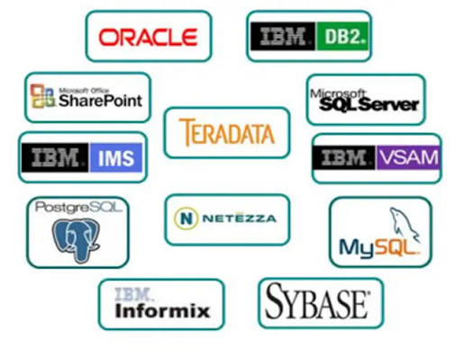
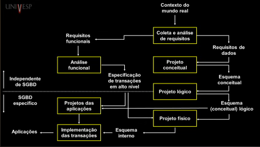
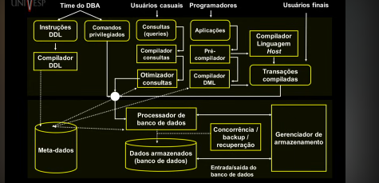

# Banco de Dados

- Fontes 

https://www.youtube.com/watch?v=pmAxIs5U1KI&list=PLxI8Can9yAHeHQr2McJ01e-ANyh3K0Lfq

Sistemas de Banco de Dados (Ramez Elmasri, Shamkant B. Navathe)

# 01 - Visão geral de banco de dados

Conceito: banco de Dados é uma coleção de dados.

### 1- O que é um dado?

Nesse contexto, um dado é um fato que deve ser armazenado(persistido) e que tem um significado implícito.
Ou seja, tem algum aspecto do mundo real que precisa ser modelada e um foco específico.

Esses dados tem uma estrutura lógica que confere um siginifcado aos dados(mini Mundo).

````
Pensa em um dado como uma informação importante que queremos guardar.

👦 Exemplo:

João tem 5 anos.

Isso é um fato sobre o mundo real que podemos guardar no computador.

A estrutura lógica é a forma de organizar esse dado para ele fazer sentido:

Nome → João
Idade → 5 anos

👉 Resumindo: dado é uma informação sobre algo real que guardamos de forma organizada para ter significado.
````
### 2- O que SGBD? 

Esse contexto que estamos trabalhando ficará armazenado e
gerenciado por um  **Sistema de gerenciamento do Banco de dados (Database Management System)**

Esse sistema é uma coleção de programas que permite que um usuario crie e mantenha um banco de dados.O SGBD  é um sistema de sftware de uso geral que facilita o prcesso de 
definição, construção, manipulação de dados entre diversos usuários e aplicações

Exemplos de SGBDS: 

  

A definição ou informação descritiva que o banco organiza eses dados é chamado de **metadados**(dados sobre os dados).

Um programa de aplicação acessa o banco de dados ao enviar consultas ou solicitações de dados ao SGBD.A consulta geralmente é recuperação de dados e transação  e 
quando quando os dados são lidos e/ou gravados no banco de dados 


- Estrutura de um sistema de Banco de dados.

  

### 3- Vantagens do SGBDs

#### 3.1 Independência entre dados e programas 

As aplicações que não usam a sgpd incorporam as estruturas de dados e fazem o controle de acesso a esses dadps 

Porém, as aplicações com SGBD não precisam lidar com controle de acesso a dados
e o armazenamento.

#### 3.2 independência entre operações e programas 

Os SGBDs permitem que operações sobre os dados sejam definidas de maneira indepndente da aplicação.

#### 3.3 Controle de Redundância
Todos os dados são armazenados no mesmo lugar e todas as aplicações acessam a mesma instância desses dados.
(evita inconsistência de dados).

#### 3.4 Controle de dados
Controla quem acessa os dados.

#### 3.5 Persistência para programas e estruturas de dados (objetos)
Podemos implementar uma serie de dados sobre algum codigo de programação e gera algum resultado desses dados.

#### 3.5 - Eficiência no processamento de consultas
Permitem consultar funcionalidades sobre os dados de forma eficiente.

#### 3.6 - Backup e recuperação

Recuperação de dados em caso de problemas

#### 3.7 - Garantia de restrição de identidade

Os dados armazanados em um banco são associados a restrições(regras).

#### 3.8 - Outras regras

- garantia de padrões
- redução de desenvolvimentos de software
- flexibilidade e disponibilidade
- economia de escala

### 4- Abstração de Dados

pra usar as funcionalidades do SGBD é precso conhecer o modelo de dados(é a estrutura lógica ou conjunto de regras matemáticas e visuais que define como os dados são armazenados, organizados, manipulados e relacionados dentro do sistema
)

### 5 - Usuarios em um Banco de dados 

- Administradores de banco de dados: Responsaveis pelo modelo de dados
que serão usados.

- Projetista de banco de dados: Lidam com a projeção do banco de dados

- Analistas de sistemas/programadores: profissionais que irão se preucupar com a aplicação que será desenvolvida ao usuários finais.

- Usuários finais 

Os profissionais são quem fazem os módulos e intefaces dos SGBDS,
os que desenvolvem as funcionalidades e o analistas de suporte dos sgbds(lidam com as demandas necessárias a ser colocados no banco de dados).

### 6 - Modelagem de dados 

#### 6.1 Níveis de Modelagem de Dados

**Conceitual**:
O nível mais alto e abstrato; foca nos conceitos de negócio, entidades principais e relacionamentos, sem se preocupar com tecnologia ou SGBD (muito proximo da forma - mais simples de explicar)[especificação e pré requisitos].

**Lógico/Intermediário**: detalha os atributos, chaves primárias/estrangeiras e as regras de negócio estruturadas, mantendo independência da ferramenta final.

**Físico**: O mais técnico e próximo do sistema; define tipos de dados exatos, tabelas, índices e códigos de criação executados no banco de dados

#### 6.2 Componentes de Abstração de Banco de Dados

**Esquema(Schema)**:É a definição estrutural do banco de dados.Determina o nome das tabelas, colunas, tipos de dados e restrições.Muda com pouca frequência (apenas quando o sistema sofre alterações de projeto).É a "intenção" ou o projeto do banco

**Instância (Instance)**: São os dados reais que preenchem as tabelas em um momento específico.Representa o conteúdo armazenado ou as ocorrências ativas.Muda constantemente a cada inserção, alteração ou exclusão de registros.É a "extensão" ou a materialização do esquema

**Estado do Banco de Dados (Database State)**:É a imagem ou retrato completo de todas as informações contidas no banco em um instante particular no tempo.É sinônimo prático do conjunto atual de instâncias.Cada comando que modifica dados transforma o banco em um novo estado.O SGBD assegura que todo estado seja válido e obedeça às regras estabelecidas no esquema.


### 7- Linguagens 

A Linguagem de consulta SQL (Structured Query Language), pode ser divida em três partes.

DQL - Data Query language (linguagem de consulta de dados )

DDL - linguagem de definição de dados 

DML - Linguagem de manipulação de dados


 - estrutura interna de um SGBD 



#


 
 

