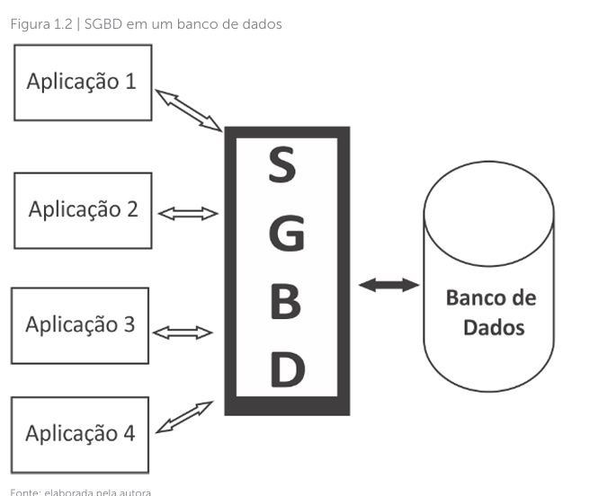
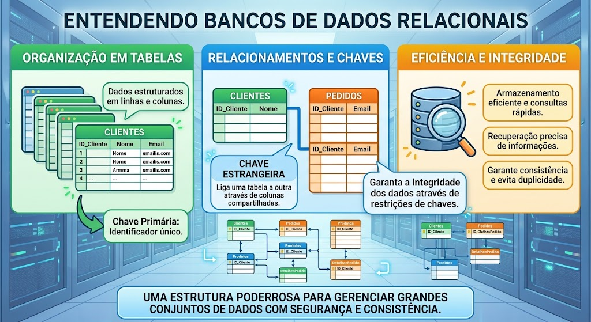
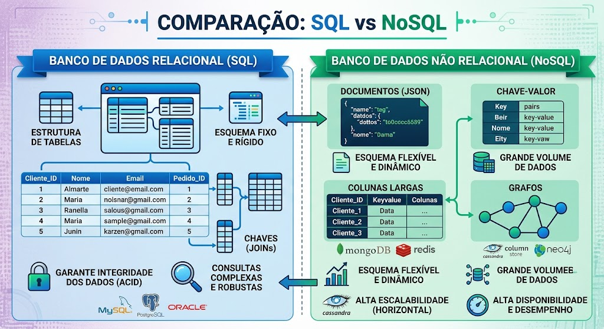
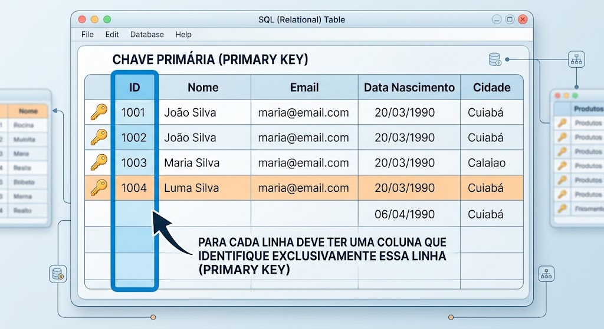
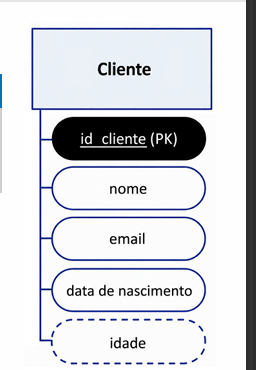
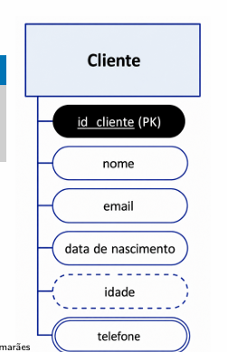
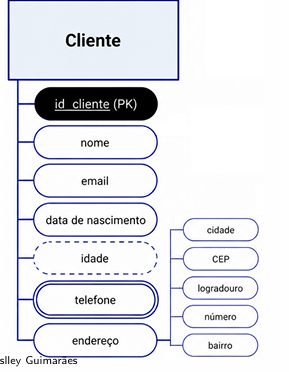
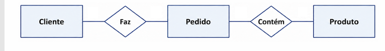
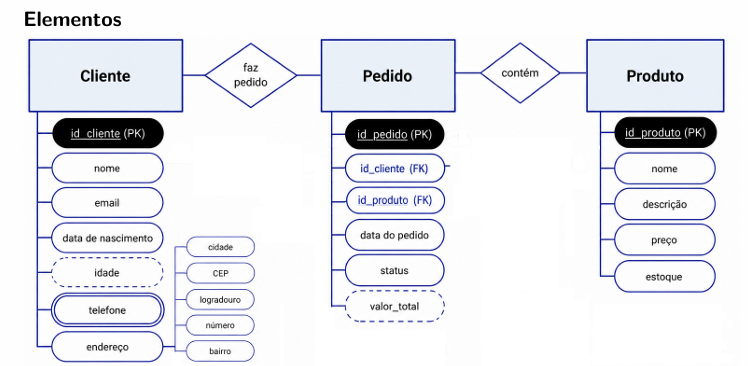

# modelagem de banco de dados

Modelagem de banco de dados, consiste 
em modelar um sistema de banco de dados para
associar a uma aplicação.

Um SGBD é  um Sistema Gerenciador de Banco de Dados é constituído por um
conjunto de dados associados a um conjunto de programas para
acesso a esses dados

### Evolução de banco de dados

1. Inicio da era da computação

Os Dados eram reepresentados em bits (o ou 1 ) sendo manipulados
por meior de cartões perfurados e fitas magnéticas.

2. Sistema de arquivos eletrônicos

Os primeiros computadores permitiu a organização de arquivos
por meio de diretórios e subdiretorios.

Porém esses sistema não tinha nenhum tipo de relacionamento entres si.

3. SBDS hierarquicos

sistemas que relacionavam entre si por meio de arquivos de textos

4. Banco de Dados Relacionais

modelo de organização de dados por meio de tabelas.
As conexões entre tabelas passaram a ser feitas por meio de chaves primarias e estrangeiras.

O primeiro database relacional  foi o Oracle Database9 (primeiro comerial)

Ex de chaves principais e secundarias ?

tabela 1 de clientes contém é sendo essa a principal  da
tabela clientes e uma outra tabela de pedidos tem uma chave principal de pedidos e a chave de clientes
ao interagir com a tabela pedios passa a ser secundarias.

5. banco de dados não relacional

E se eu pegar informações com formatos diferentes ou seja uma uniformidade no formato dos dados

Nesse caso eu uso um banco que organiza esses dados

## Transações

Uma unidade lógica de trabalho (ou processamento) no banco de dados
correspondendo a execução do programa.

Elas fazem parte do CRUD ou seja as quatos operações básicas de um porgrama

Todas as transações devem possuir as seguintes propriedades.

### Requisitos de um banco de dados(ACID).

- Atomacidade

garante que nenhuma ou a tonalidade das 
operações da transação sejam realidade com sucesso

- Consistência

A consistência é
a garantia de manter os dados íntegros durante e com a finalização
da transação realizada no banco de dados.

- Isolamento

Uma transação não deve sofrer interfêrencia
de quaisquer outras transações concorretes.

- Durabilidade

As mudanças aplicadas ao banco de daos por uma transação
efetivada devem persistir no banco de dados.

## Diferença de de DER x MER

DER -  diagrama de entidade - relacionamento
MER -  modelo de entidade e relacionamento

O mer é uma técnica de modelagem de dados que utiliza
o diagram de entidade relacionamento para visualizar  a estrutura e as relaçõs entre os dados em um sistema de banco de dados.

### Entidade

entidade é uma representação de um objeto do mundo real ou um conceito

sendo reprentados por retangulos nos DER:

### atributo
atributo é uma propriedade ou caracteristica que descreve a entidade

#### tipos de atributo.

##### atributo chave  -  um atributo especial

atributo chave indentifica  de forma unica cada instancia da entidade.

##### atributo derivado

é um attibuto cujo valor pode ser derivado(calculado) a parti de  outros atributos

##### atributo multivalorado

um atributo que pode assumir multiplos valores

##### atributo compostos

um atributo composto  é aquele que contem varios subatributos.

#### Relacionamento

é uma associação entre entidades que indicam como elas
estao inteligadas.

Exemplo de mer:

#### cardinalidade
indica a quantidade mínima e maxima de instancia de uma entidade podem estar associadas a uma instância de outra entidade em um relacionamento

