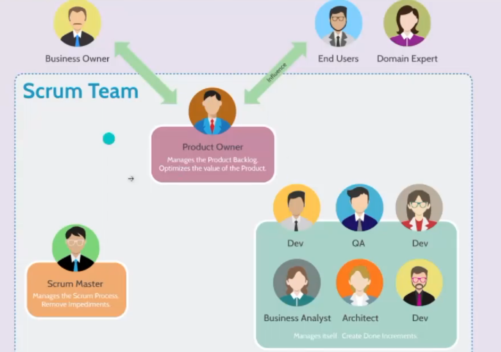

## O que faz um Dev? 

#### Tarefas de um Dev

1) Escrever códigos 
2) Procura por erros, melhorias no código
3) Ferramentas pra Monitoriamento do código
4) Resolução de bugs imediados
5) Reuniões 
6) Verificação de código e avaliar códigos
7) Trabalhamos com Banco de Dados

### Quem faz parte da equipe de trabalho do dev? (SQUAD)

1) Um Product Owner (PO) 

é Um papel fundamental no Scrum , que atua como ponte entre os objetivos de negócios e a equipe de desenvolvimento..

2) Lider Técnico/Architeto de Software

O líder técnico e o arquiteto de software reuniram papéis essenciais para desenhar sistemas e orientar equipes de desenvolvimento no dia a dia.

3) Scrum Master

O Scrum Master é o profissional líder-servidor responsável por garantir que a estrutura ele 
é resposável pela agilidade do time

4) QA - Quality Assuranc (garantia de qualidade)

Testa o código dos dev e ve se não tem nada de errado pros usuários finais

