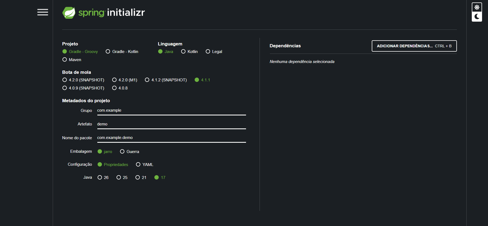

# Ecossistema java 
#### arquivo descritivo de todas as ferramentas do
ecossistema java de desenvolvimento, podendo ser copiados partes
em outros arquivos markdown posteriormente.

## Spring Boot (spring inicializer)

Para criar um projeto usando o spring boot 
você pode criar no próprio intell IDEA porém apenas pra planos pagos 
ou você usa o spring inicializer(uma ferramenta oficial baseada na web (e integrada em vários IDEs) usada para gerar a estrutura básica (boilerplate) de projetos Spring Boot de forma rápida, configurando metadados, a ferramenta de build e dependências iniciais automaticamente)

### spring inicializer

sobre a aba projetos:

1. o klotin é a linguagem parecida com java pra mobile
2. o grove é um  configurador de depêndencia antigo
3. maven é um configurador de depêndencias mais atual usado pelo mercado de dev java

sobre a linguagem:
a mesma coisa, sendo o groovy uma linguagem java mais antiga entre aspas

sobre a versao o springbot  e sempre a versao mais atualizada dele por padrão

. o grupo é a empresa controladora do projeto

uma convenção e colocar o grupo controlador de trás pra frente a sua url

ex: de.java10x

artiface é o nome da pasta e o name o  nome do projeto. Uma convenção e deixar os dois iguais.

por último tem o arquivamento de arquivo e o .jar

por fim apenas falta configurar as dependencias.

Essas dependências nada mais são que integrações com as ferramentas de desenvolvimento.

exs:

tom cat -  biblioteca spring que ajuda a trabalhar com a internet

- coisas padrão baixadas em um projeto:

mvm -  wapper compactado
src - testes, main
git ignore - trabalhar com git
poom.xml - depêndencia do projeto em xml(configuração do projeto).

### configurando o git no Projeto

tem duas de configurar o git 
1. via terminal 

