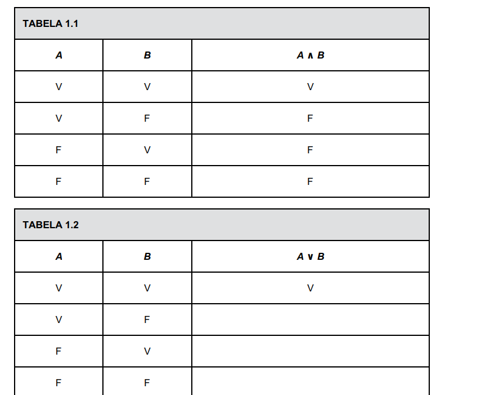
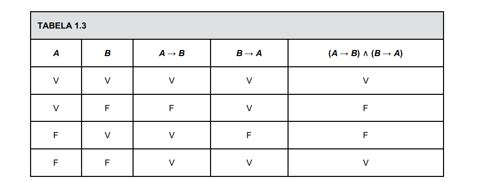
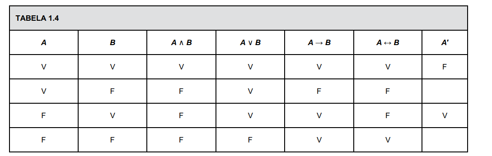

# Matemática Discreta

## Bibliografia 

Fundamentos Matemáticos para a Ciência da computação
Judith L. Gersting

https://www.youtube.com/watch?v=KGoSTh1sgyM&list=PL6mfjjCaO1WrEJ0JKRyXO3QjaPkJaSvAS

playlist de aulas

## CAP 1 - Lógica Formal

- Definição de lógica formal 

A lógica formal é o ramo da filosofia e da matemática que estuda a estrutura, a forma e a validade dos argumentos dedutivos, independentemente do conteúdo ou do significado real de suas proposições

### SEÇÃO 1.1 PROPOSIÇÕES, REPRESENTAÇÕES SIMBÓLICAS E TAUTOLOGIAS

**Uma proposição (ou declaração) é uma sentença que é falsa ou verdadeira.**

````
Considere as seguintes sentenças:
Dez é menor do que sete.
Cheyenne é a capital do estado americano de Wyoming.
Ela é muito talentosa.
Existem outras formas de vida em outros planetas no universo
````
A sentença (a) é uma proposição, já que é falsa. A sentença (b) é uma proposição, já que é verdadeira. A sentença (c) não é falsa
nem verdadeira, pois “ela” não está especificada; por isso, (c) não é uma proposição. A sentença (d) é uma proposição, já que é ou
falsa ou verdadeira; nós não precisamos ser capazes de decidir qual das alternativas é válida.

### Conectivos e Valores Lógicos

Na lógica temos conectivos e valores lógicos sendo esse componentes essenciais
em uma construção de setença.

#### Conectivos Binários

**Letras de Preposição**: Letras maiscúlas no incio das frases pra indicar a preposição, (A),(B),(C).

**Conectivo Lógico E**: Repreentado por E ou o símbolo lógico  ∧

**Conectivo Lógio Ou**: Representado por OU  ou o símbolo lógico V

**Conjunção:** A expressão A ∧ B é chamada a conjunção de A e B; A e B são denominados **os elementos, ou fatores**, dessa expressão.

**Disjunção:** A expressão A ∨ B (leia “A ou B”) é a disjunção de A e B; A e B são os elementos,
ou fatores, da disjunção.

_tabela verdade E e OU_



**Condicional:** Proposições podem ser combinadas na forma “se proposição 1, então proposição 2”. Se A denotar a proposição 1 e B a 2, a proposição composta
é denotada por A → B (leia “A condiciona B”). O conectivo lógico aqui é o condicional e significa que a verdade de A implica, ou leva a, a verdade
de B. No condicional A → B, **A é a proposição antecedente e B, a consequente**

**Bicondicional** O conectivo bicondicional é simbolizado por ↔. Ao contrário da conjunção, da disjunção e do condicional, o conectivo bicondicional não é, de
fato, um conectivo fundamental, é um atalho conveniente. A expressão A ↔ B é uma abreviatura de ( A → B) ∧ (B → A). Podemos escrever a tabelaverdade para o bicondicional construindo, passo a passo, a tabela para (A → B) ∧ (B → A)



#### Conectivos Unitarios

**negação** é um conectivo lógico unário. A negação de A — simbolizada por A′ — é lida como “não A”.

#### Resumo dos conectivos 




