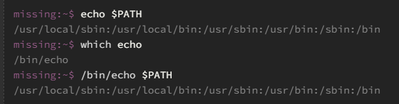

# O semestre que falta na sua formação em Ciência da Computação

- Fontes

https://missing-semester-pt.github.io/2020/course-shell/

## 01 - Visão geral do curso + Introdução ao Shell

- O que é o shell? 

É a interface textual do computador que atua como intermediário entre o usuário e o sistema operacional. Eles
funcionam como linguagems de programação, ou seja contém variavéis, loops , condicionais e etc.
Nesse curso vamos abordar o terminal BASH do linux, por ser um dos mais populares e de fácil acesso
em qualquer máquina.

- Outros nomes para o shell

O terminal(shell) tem vários nomes como CLI, terminal, bash, shell, interface de comando
linha a linha e etc. Porém no geral, todos siginificam a mesma coisa - o terminal

- Usando o shell 

Quando você inicia o terminal, vai encontrar prompt inicial
com uma única linha no topo que é conhecido como prompt do shell - shell prompt.

Ele contém meu nome de usuário, nome da maquina que estou usando, o caminho da pasta onde estou, 
é o $ serve pra te mostrar onde digitar e que você não é um usuario root(administrador máximo em sistemas operacionais baseados em Unix, como o Linux).

Esse prompt é bastante personalizavél e pode variar bastante de um terminal pra outro mas 
no geral seguindo sempre essa nomeclatura. 

- comandos do shell uteís (ou nem tanto)

date- mostra a data e hora do computador

echo - comando pra exibir texto

clear - limpa o terminal

pwd - saber a localização no diretorio atualmente

cd /local - mudar a o caminho relativo atual

cd.. - subir pra um pasta acima da atual

cd ~  - leva pro diretorio home 

cd - -> vai pro repositorio anterior que você estava

ls- listar os aqrquivos do diretório

--help/-h/man - lista todos os programas do shell e explica o que fazem (biblioteca)[use q pra sair].

comando --help -> explica as opções e o que faz esse comando faz.

- Como o terminal sabe o que cada comando faz? 

O seu computador vem com inúmeros programas embutidos, entre eles um para específicações de terminal.
Quando você executa um comando no shell, você está escrevendo um pequeno pedaço de código que seu shell interpreta. Se você digita um comando que o shell não reconhece, ele consulta uma variável de ambiente chamada $PATH que lista quais diretórios que o shell deve procurar por programas

Para saber exatemente o que um comando/programa roda usamos o comando which +
programa que queremos saber 

Ex: which echo

No caso nos foi mostrado o caminho até a execução desse programa.

- O que são os caminhos (path)?

Os caminhos são a localização do arquivo em seu computador. No sistemas linux e MAcOs são usados
/ pra separar as pastas dos diretórios, no windows tem uma repatição com C:\ ou D:\, tendo um tipo de hieraquia de caminhos de sistema para cada drive.

Existe caminhos absolutos e relativos, sendo os absolutos os que permanecessem inalterados no computador e os 
relativos são aqueles que estamos acessando no momemento.

- navegando no shell

Geralmente, iremos rodar um programa, e ele irá operar no diretório atual

- Permissões de arquivos e diretórios

Quando você executa a ajuda ou no manual dentro dele você vai ter 
que tem as permissoes de acesso aquele arquivo.

você recebe algo como assim:

drwxr-xr-x 1 missing users 4096 Jun 15 2019 missing

d rwx r-x r-x

│ │   │   │

│ │   │   └── outros usuários - especificações de uso de outros usuarios

│ │   └────── grupo - usuarios que vão ler e executar o arquivo

│ └────────── dono -quem pode lear , escrever e executar o arquivo.

└───────────── tipo - tipo de aquivo

- Flags e opções

é um argumento opcional passado para um comando ou script para mudar o seu comportamento.

