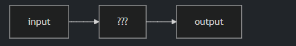
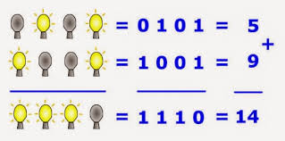
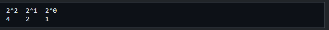
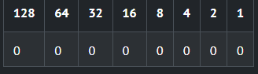
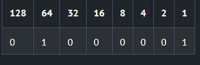
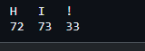
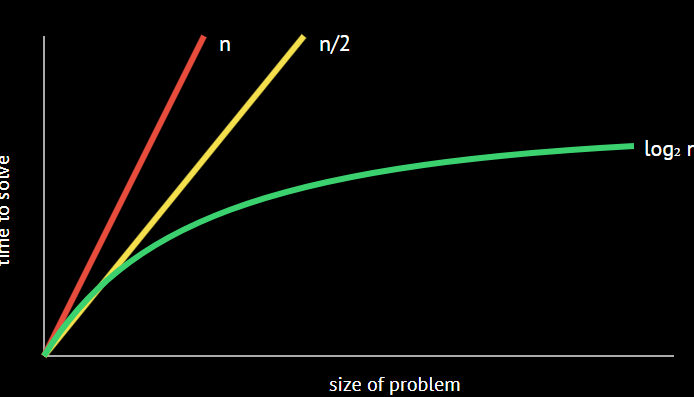
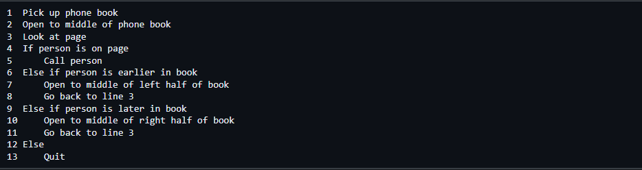
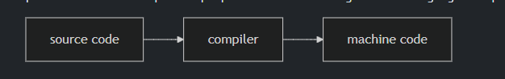

# Curso de introdução a ciência da computação de havard 
link do curso: https://learning.edx.org/course/course-v1:HarvardX+CS50+X/home

## Aula 01 - Semana 0 [Scratch] 

### Ciência da Computação e Resolução de Problemas

Essencialmente, a programação de computadores consiste em receber uma entrada e gerar uma saída — resolvendo, assim, um problema. O que acontece entre a entrada e a saída, o que podemos chamar de caixa preta, é o foco deste curso.

Os computadores usam o sistema binário pra receber/ funcionar ou seja é a linguagem deles (0 ou 1 )

um digito binário é chamado de bit, sendo 1 para ligado e 0 pra desligado 

Os computadores só se comunicam em termos de zeros e uns. Zeros representam desligado. Uns representam ligado. Os computadores são milhões, e talvez bilhões, de transistores que são ligados e desligados.

Se você imaginar usar uma lâmpada, uma única lâmpada só pode contar de zero a um.
No entanto, se você tiver três lâmpadas, terá mais opções à sua disposição!
Dentro de seus dispositivos, como seu iPhone ou computador, existem milhões de lâmpadas metafóricas chamadas transistores , que possibilitam as atividades realizadas nesses dispositivos que muitas vezes consideramos corriqueiras no dia a dia.

Os computadores usam o sistema binário (base 2) para contar. Isso pode ser visualizado da seguinte forma:

Os computadores geralmente usam oito bits (também conhecidos como bytes ) para representar um número. Por exemplo, 5 00000101representa o número 5 em binário . 111111110 representa o número 255. Você pode imaginar o zero da seguinte forma:

### ASCII

Assim como os números são padrões binários de uns e zeros, as letras também são representadas usando uns e zeros

Como existe uma sobreposição entre os uns e zeros que representam números e letras, o padrão ASCII foi criado para mapear letras específicas para números específicos.

Por exemplo, Adecidiu-se que a letra corresponderia ao número 65. 01000001representa o número 65 em binário. Você pode visualizar isso da seguinte forma:

Se você recebeu uma mensagem de texto, o código binário dessa mensagem pode representar os números 72, 73 e 33. Convertendo esses números para ASCII, sua mensagem ficaria assim:

segue abaixo uma tabela ASCII

https://www.ime.usp.br/~kellyrb/mac2166_2015/tabela_ascii.html

### Unicode

Com o passar do tempo, surgiram cada vez mais maneiras de se comunicar por mensagem de texto.

Como o sistema binário não possuía dígitos suficientes para representar todos os caracteres que poderiam ser representados por humanos, o padrão Unicode expandiu o número de bits que podem ser transmitidos e compreendidos pelos computadores.

O Unicode inclui não apenas caracteres especiais, mas também emojis.

Existem emojis que você provavelmente usa todos os dias. Os seguintes podem lhe parecer familiares:

😀 😃 😄 😁 😆 😅 😂 🙂 🙃 😉 😊 😇 😍 😘 😗 😙 😚 😋 😛 😜 😝 🤑 🤓 😎 🤗 😏 😶 😐 😑 😒 🙄 😬 😕 ☹️ 😟 😮 😯 😲 😳 😦 😧 😨

_Obs: Embora o padrão de zeros e uns seja padronizado dentro do Unicode, cada fabricante de dispositivo pode exibir cada emoji de maneira ligeiramente diferente de outro fabricante._

### RGB

Os números zero e uns podem ser usados ​​para representar cores.
Vermelho, verde e azul (chamados de RGB) são uma combinação de três números.

72 73 33

Considerando os valores 72, 73 e 33 que usamos anteriormente e que foram expressos HI!em texto, os leitores de imagem os interpretariam como um tom claro de amarelo. O valor vermelho seria 72, o valor verde seria 73 e o azul seria 33.

Os três bytes necessários para representar as diversas cores vermelha, azul e verde (ou RGB ) compõem cada pixel (ou ponto) de cor em qualquer imagem digital. Imagens são simplesmente coleções de valores RGB.

Os números zero e uns podem ser usados ​​para representar imagens, vídeos e música!

Vídeos são sequências de várias imagens armazenadas juntas, como um flipbook.

A música pode ser representada de forma semelhante usando várias combinações de bytes.

### Algoritmos 

resolução de problemas é fundamental para a ciência da computação e a programação de computadores. Um algoritmo é um conjunto de instruções passo a passo para resolver um problema.

Imagine o problema básico de tentar localizar um único nome em uma lista telefônica.

Como se poderia fazer isso?

Uma abordagem possível seria simplesmente ler da página um para a seguinte, até chegar à última página.

Outra abordagem seria pesquisar duas páginas por vez.

Uma abordagem final, e talvez melhor, seria ir até o meio da lista telefônica e perguntar: "O nome que estou procurando está à esquerda ou à direita?" Em seguida, repita esse processo, dividindo o problema ao meio, depois ao meio novamente e depois ao meio novamente.

Cada uma dessas abordagens pode ser chamada de algoritmo. A velocidade de cada um desses algoritmos pode ser representada da seguinte forma, na chamada **notação Big-O** 

Observe que o primeiro algoritmo, destacado em vermelho, tem uma complexidade de notação Big-O de O(n log n), npois se houver 100 nomes na lista telefônica, pode levar até 100 tentativas para encontrar o nome correto. O segundo algoritmo, em que duas páginas foram pesquisadas por vez, tem uma complexidade de notação Big-O de O(n log n), n/2pois a busca nas páginas foi realizada duas vezes mais rápido. O algoritmo final tem uma complexidade de notação Big-O de log₂ n , já que dobrar o problema resultaria apenas em mais um passo para resolvê-lo.

Os programadores traduzem instruções humanas baseadas em texto em código para resolver problemas.

### Pseudocódigo 

 pseudocódigo consiste em instruções legíveis por humanos que geralmente descrevem os passos de um algoritmo.

A capacidade de criar pseudocódigo é fundamental para o sucesso tanto nesta disciplina quanto na programação de computadores.

Por exemplo, considerando o terceiro algoritmo acima, poderíamos compor o pseudocódigo da seguinte forma:

A pseudocodificação é uma habilidade muito importante por pelo menos dois motivos. Primeiro, ao usar pseudocodificação antes de criar o código formal, você consegue pensar na lógica do problema antecipadamente. Segundo, ao usar pseudocodificação, você pode fornecer essas informações posteriormente a outras pessoas que desejam entender suas decisões de codificação e como seu código funciona.

Observe que a linguagem em nosso pseudocódigo possui algumas características únicas. Primeiro, algumas dessas linhas começam com verbos como pegar, abrir, olhar. Mais tarde, chamaremos essas funções de .

Em segundo lugar, observe que algumas linhas incluem declarações como ifou . else if.Estas são chamadas de condicionais .
Terceiro, observe como existem expressões que podem ser declaradas como verdadeiras ou falsas, como "a pessoa está mais cedo no livro". Chamamos essas expressões de expressões booleanas .

Por fim, observe como existem instruções como "volte para a linha 3". Chamamos isso de loops .

Esses elementos básicos são os fundamentos da programação.
No contexto do Scratch , que será discutido a seguir, utilizaremos cada um dos blocos de construção básicos da programação mencionados acima.

### Scratch  

Foi abordado o scratch várias vezes no curso de lógica de programação do gustavo guanabara, por conta disso tudo relacionado será pulado, com excessão ao que eu achar importante.

obs: as atividades serão feitas posteriormentes e lançadas no github.
https://cs50.harvard.edu/x/psets/0/scratch/

o fluxo especificado no curso será mantido

## Aula 02 - Semana 1 [C] 

#### Questions 

- What is source code ?
- Como os computadores entendem?
- o que é código de máquina ?
- o que é um compilador? 
- O que é sintaxe? 
- O que é CLI?
- O que é GUI ?
- O que é um editor de texto ?
- O que é um explorador de arquivos
- O que é comandos de escape?
- o que é uma biblioteca? 

### Código-fonte

Lembre-se de que as máquinas só entendem código binário. Enquanto os humanos escrevem código-fonte , uma lista de instruções para o computador que é legível para humanos, as máquinas só entendem o que hoje chamamos de código de máquina . Esse código de máquina é um padrão de uns e zeros que produz o efeito desejado.

Descobrimos que podemos converter código-fonte em código de máquina usando um software muito especial chamado compilador . Hoje, apresentaremos um compilador que permite converter código-fonte da linguagem de programação C em código de máquina.

para a resolução de e criação dos nossos códigos usaremos o vscode para facilitar questões técnicas e a linguagem C por ser mais recepitiva com iniciantes.

O VS code tem 4 itens relevantes a serem citados 

1) Explorador de arquivos no lado esquerdo, onde você pode encontrar seus arquivos.

2) Editor de texto , onde você pode editar seu programa.

3) Interface gráfica do usuário (GUI), na barra lateral esquerda, várias ferramentas e um explorador de arquivos.

4) por fim há uma (command line interface) interface de linha de comando (CLI ) ou janela de terminal , onde podemos enviar comandos para o computador na nuvem.
 
 

#### Comandos de terminal 

code  -> criar um novo arquivo
make  -> compila o arquivo a partir de nossas instruções na linguagem  e cria um arquivo executável chamado o nome que demos.
./ () -> executa o programa executado que criamos  

#### caracteres de escape
\n cria uma nova linha
\r retorna ao início de uma linha
\" imprime aspas duplas
\' imprime aspas simples
\\ imprime uma barra invertida

#### Arquivos de cabeçalho e páginas do CS50

A instrução no início do código #include <stdio.h>é um comando muito especial que informa ao compilador que você deseja usar os recursos de uma biblioteca chamada `studio` stdio.h, um arquivo de cabeçalho `<header>` . Isso permite, entre muitas outras coisas, utilizar a print
