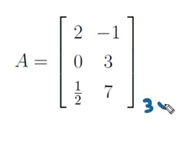
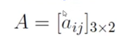

# Geometria Analítica

### Matrizes 

#### Definição

Uma matriz é uma tabela de números organizadas em linhas(-) e colunas(|) com uma ordem  de  M x N (m - linhas , n - colunas )

#### Estrutura de uma matriz

obs: uso de colchetes e letras pra colocar indicar ela.

#### Notação

A -> a matriz

a -> elementos da matriz

i -> n da linha 

j -> n da coluna

obs: cadas elemento possui o seu endereço(ex: na 1 matriz de exemplo  o a12 é o -1)

