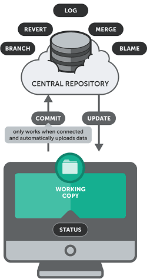
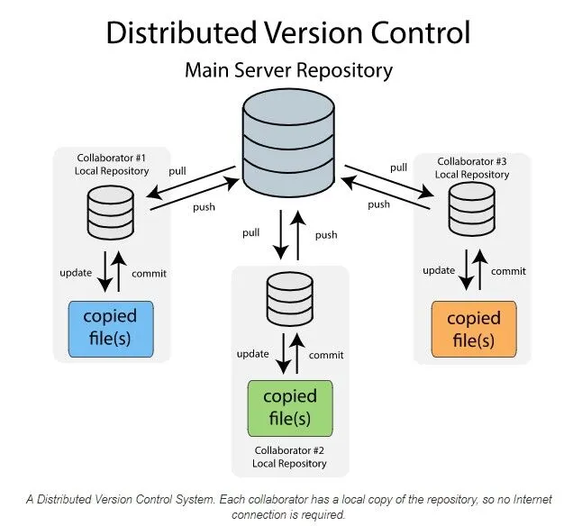

# Primeiro repositório !
primeiro repositório versionado

Repositório feito durante curso de git e gitHub do - Gustavo guanabara.

link do curso:https://www.youtube.com/playlist?list=PLHz_AreHm4dm7ZULPAmadvNhH6vk9oNZA

Durante o Curso aprendi como utilizar o git,github,github desktop, é como editar o os arquivos em uma IDE.

---
# Aulas
1)O que é Git? O que é versionamento? – Curso de Git e GitHub

2)O que é GitHub? Pra que ele serve? – Curso de Git e GitHub

3)A Evolução do Git e GitHub – Curso de Git e GitHub

4)Instalações e configurações importantes – Curso de Git e GitHub

5)Criando o primeiro Repositório – Curso de Git e GitHub

6)Instalando GitHub Desktop no Linux – Curso de Git e GitHub

7)Clonando um Repositório – Curso de Git e GitHub

8)Versionando seus projetos antigos – Curso de Git e GitHub

9)Você sabe usar Issues? – Curso de Git e GitHub

10)Guia da Linguagem Markdown – Curso de Git e GitHub

11)Seu GitHub muito mais seguro – Curso de Git e GitHub

12)Git Branches de forma fácil e com exemplo – Curso de Git e GitHub

13)Hospedagem Grátis no GitHub Pages – Curso de Git e GitHub

esse curso foi pra facilitar meu início com git e github sem código, nas próximas linhas vamos explicar o aprendizado de git e github completo.

roteiro utilizado para guia:https://roadmap.sh/git-github

### Aprendendo o básico

#### Objetivos 

- Entender o que é VCS

- Entender por que usar um sistema de controle de versão

- Entender a diferença do GIT pra outros vcs

-Instalar o Git localmente 

#### O que é VCS?

VCS é version control system ou sistema de controloe de versão é uma ferramenta de software que rastreia, organiza e gerencia alterações em arquivos e código-fonte ao longo do tempo.Ele funciona como uma "máquina do tempo" do projeto, permitindo visualizar estados anteriores, experimentar com segurança sem comprometer o projeto principal e reverter para versões anteriores caso ocorram erros.

Em vez de renomear os aquivos manualmente a cada atualização (feature), um vcs aoutomatiza o processo criando snapshots(versões) do seu código fonte.

### Tipos de VCS

centralizado/linear: Cada desenvolvedor baixa uma cópia completa do projeto, incluindo todo o seu histórico. Isso significa que você pode trabalhar offline e seus dados ficam altamente seguros contra falhas do servidor.

distribuido: Todas as versões dos arquivos são hospedadas em um único servidor central. Os desenvolvedores baixam os arquivos de que precisam, fazem as alterações e os enviam diretamente para o servidor.

### Termos de VCS

Repositório -  É o banco de dados (ou pasta) que armazena todo o histórico, arquivos e versões do seu projeto. Pode ser local (na sua máquina) ou remoto (hospedado na nuvem, como o GitHub).

Commit: É a "fotografia" do estado atual do seu projeto. Cada vez que você salva e registra suas alterações, você cria um commit. Ele recebe um código identificador único.

Branch (Ramificação/Galho): Uma ramificação independente do seu código. Permite que você crie novos recursos ou teste coisas novas sem alterar o código principal (a versão de produção). A ramificação principal padrão costuma se chamar main ou master

Merge (Mesclagem): O processo de unir as alterações feitas em uma branch de volta para outra (geralmente para a ramificação principal)

Push: Enviar os seus commits locais para um repositório remoto na internet.

Pull: Baixar as alterações mais recentes do repositório remoto para a sua máquina local e já aplicá-las ao seu projeto.

Clone: O ato de copiar um repositório remoto para a sua máquina local, baixando todos os arquivos e o histórico de commits.

Fork - Fazer a copia de um repositorio remoto de outra pessoa 

Fetch: Baixar as atualizações do repositório remoto, mas sem aplicá-las ou misturá-las com o seu código atual. Ele serve apenas para você visualizar o que a equipe alterou.

Conflict (Conflito): Ocorre quando duas pessoas alteram a mesma linha de um arquivo de formas diferentes e o sistema não consegue decidir qual versão manter. O conflito precisa ser resolvido manualmente.

As Issues (que significa "problemas" ou "questões") no GitHub funcionam como um gerenciador de tarefas e discussões.

Um Pull Request (PR) no GitHub éuma proposta para mesclar alterações de código de uma ramificação em outra

### Partindo para o Git