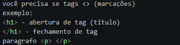
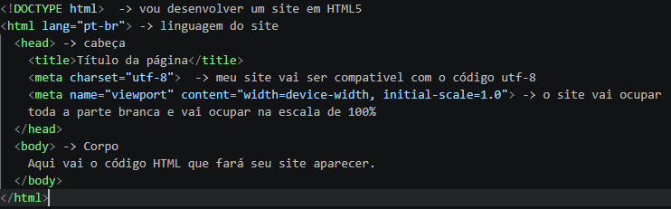
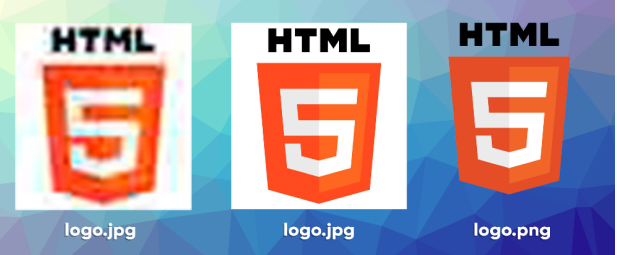
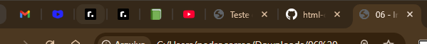
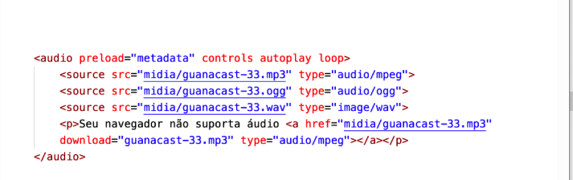

# HTML E CSS
## Repositório pra registro do curso de 5 módulos de HTML e CSS3 do curso em vídeo.
---
### O que vamos aprender? 

#### Módulo 1 - Primeiros passos (cap 1 a 12)
1) Evolução da internet
2) Como Surgiu?
3) Como a internet funciona?
4) Como Funciona os protocolos? 
5) O que é dominio e hospedagem e qual a diferençã?
6) Qual a diferença entre as linguagens HTML, CSS e  JS?
7) Qual a diferença de back end pra front end
8) Como Organizar o Ambiente de desenvolvimento
9) Como fazer a estrutura básica de HTML
10) Porque do posionamento de cada comando
11) Diferença de maiusculas pra minusculas
12) Como Trabalhar com textos 
13) Como colocar símbolos e emojis
14) Como organizar o contéudo de forma hierarquica
15) Vamos entender a semântica de HTML5
16) Aprender a usar links e ancoras
17) Aprender a trabalhar com multimia (vídeos,imagens e aúdios)
18) Como Aplicar estilos nas CSS 

#### Módulo 2 - Deixando as coisas mais bonitas (cap 13 a 17)
19) Psicologia das cores 
20) Harmonização de cores
21) Paleta de cores 
22) Tipografia (fontes)
23) Estudos das CSS 
24) variaveis em CSS
25) Modelo de caixas 
26) Criação de site do zero

### Módulo 3 - Do repositório ao site online  (cap 18 a 21)
27) Como hospedar seu site 
28) Configurações de CSS pra imagens de fundo
29) Criação de projeto de Cordel
30) Como trabalhar com tabelas 

### Módulo 4 - páginas web completas, funcionais e responsivas. (Cap 22 a 26)
31) Iframes 
32) Projeto Rede sociais
33) Formulários 
34) Design Responsivos 
35) Projeto tela de login responsiva

### Módulo 5 - Aprofundamento em  técnicas de CSS3 para criar páginas modernas e responsivas (novas tecnlogias)
36) Flexbox
37) Grid Layout
38) Projeto Final

Acesse a pasts questões HTML e CSS, exercícios e Desafios para ver o que foi feito durante o curso
---
- melhores livros pra aprender HTML e CSS
1) Material de apoio - curso em vídeo
2) Rerências on-line
MDN
W3C Standards
Whatwg Living Standard
W3Schools
4) Livros 
Serie O' Reilly 
HTML5 e CSS3 - Um guia prático e visual de html5 e css 3
HTLM e CSS - Projete e constua sites
HTML e CSS - Use a cabeça
Crie seu próprio site 
Fundamentos de HTML5 e CSS 3 - Moujour
HTML5: a Linguagem de Marcação que Revolucionou a Web - Moujour
CSS Grid Layout: Criando Layouts CSS Profissionais - Moujour
CSS3 - Moujour


---
## Módulo 1 - Primeiros passos 

1) Evolução da internet
2) Como Surgiu?
3) Como a internet funciona?

##### História da Internet

A internet surgiu durante a guerra fria, com a URSS lançando um sátelite espacial(Sputinick), para saber a órbita da terra, no entando, os EUA achavam que era algum tipo de sátelite espião. Nessa perspectiva, o governo dos Estados Unidos temia um ataque russo às bases militares. Um ataque poderia trazer a público informações sigilosas, tornando os EUA
vulneráveis. 

Então foi fundado uma agência pra estudos de tecnologias de guerra a DARPA - (Defense Advanced Research Projects Agency) é a agência do Departamento de Defesa dos EUA, com o intuito de proteger informações de um possível ataque.

Com isso, eles criaram uma rede de compartilhamento entres as bases militares a ARPANET. A ARPANET funcionava através de um sistema conhecido como chaveamento de pacotes, que é um sistema de transmissão de dados em rede de computadores no qual as informações são divididas em pequenos pacotes, que por sua vez contém:
• trecho dos dados
• o endereço do destinatário
• informações que permitiam a remontagem da mensagem original. 

Esses sistema, funcionava por meio de um protocolo chamado NCP - Network Control Protocol (protocolo de controle de rede) e de maneira simples tinha o obejtivo de vários computadores falarem a mesma linguagem.


Porém, o NCP tinha um problema de funcionar apenas uma comunicação por vez, ou seja, ao longo de uma transmisão, se outro conputadores quiserem se comunicar tem que esperar o fim da transmissão.

Pra acabar com isso dois pesquisadores criaram dois protocolos que depois foram juntados o TCP/IP 

Bob kahn -> TCP (Transfer control protocol) várias transmissoes 
Vint Cerf - IP (internetwork Protocol) - Indentificador de máquinas 

Com o tempo a ARPANET cresceu tanto que eles resolveram separar ela em três redes.

MILNET - MILITAR 
NFFNET - CIENTÍFICA
Comerciais

Essas redes queriam se conectar em inglês - Interconnect Networking que abreviando fica internetwoking que abreviando de novo fica internet.

##### Como funciona a internet?

1) O computador transfere a informação solicitada por meio de pacotes e enviado para o destinatario (O IP indenfica o destinatario e enviador e o tcp envia os pacotes depois de quebrar a mensagem )

###### O passo a passo da Infraestrura da internet

Primeiramente a internet e dividida em milhas, a primeira é ultima milha server pra tudo que fazemos para nos conectar ou receber informações.

O dispostivo manda os pacotes por meio de ondas de rádio que o receptor (o roteador domestico ou movel), determinar se são 0 ou 1 por meio de uma frequência pré establecida (frequência da modulação). O roteador tem que transformar esses sinais em outras coisas para passar pelos cabos de transmisão até o IPS (provedores de internet)[responsável por achar a melhor rota pra informação]. 

Em muitos contextos esses dispostivos são chamados de modem pois fazem o processos de modulação(de ondas quadradas a ondas sinoidais) e demodulação (de onda sinoidal a quadrada).

Esse motivo e porque ele "junta" esses aparelhos em um só o que chamamos de gateway

Os IPS levam essas informações até os Hubs de Internet, nos hubs de internet e eles repassam pelos ips e devolvem ao destinatario, sempre buscando a rota mais curta. Mas e se essa mensagem sair da região de distribuição de internet dos IPS?

Nesse ponto chegamos as espinhas centrais da internet, por meio de cabos submarinos são interligado os litorais dos paises.

Ok, nesse ponto abrangimos, quase tudo sobre a infraestrutura da internet, mas você deve se perguntar, e aqueles que não tem IPS em suas regiões e não moram e regiões litorâneas? 


Para isso temos meios de trasnmissão de internet para todos como sátelites e balões atmosfericos que funcionam como cabos por meio de ondas de rádio e assim sendo usados como pontos de transmissão.

##### Como era a internet antigamente?


Por meio de um protocolo de navegação chamado gopher, era acessado as informações que o funcionário queria.

Em 1993 um inglês chamado Tim Berness-Lee criou um protocolo que foi incluido mais tarde no TCP/IP o HTTP (HyperText Transfer Protocol) e a linguagem HTML (HyperText Markup Language) e com isso mudou a internet pra uma World Wide Web (rede de alcançe mundial) pois permitia a facilitação do funcionamento da internet.

Outra coisa que foi criado pra internet funcionar foi um navegador (O Mosaic) 

No caso a World Wide Web e uma subrede da internet.

##### Representação de Dados
01- digitato binario -> bit ->  8 bits -> byte (porção minima pra representação de dados) 
Código do teclado atual -> código mulitbyte UTF-8


transfomação e a cada cojunto de 1024
1024 bytes = 1 KB (\(2^{10}\))
1024 KB = 1 MB
1024 MB = 1 GB
1024 GB = 1 TB
1024 TB = 1 PB
1024 PB = 1 EB
1024 EB = 1 ZB
1024 ZB = 1 YB

MB <> Mb (Megabytes[armazenamento] e megabits[transmissão])

##### Voltando a internet o passo a passo

1) computador pede mensagem (requisão) essa mensagem é divida em partes e enviadas em pacotes de bytes 

2) O roteador recebe e transforma em ondas sinoidais para passar pela infrestrutura da internet

3) a mensagem chega no servidor e o servidor devolve a mensagem ou para o cliente ou para destinatario do cliente de forma invesa do processo de envio 

### detalhando o processo (o IP)
-para que se acha as pessoas e locais da internet que as mensagem deve passar e recolher/enviar informações temos o IP (interconnect protocol) que da um número de  x diugitos e informa para outra parte que vamos falar agora.
Os IPs mais modernos (IPv6), usam 128 bits ao todo (o que é 4x mais bits que o
IPv4).
Ex: 2001:0db8:85a3:08d3:1319:8a2e:0370:7344

##### Servidores DNS 
A internet tem uma "agenda eletrônica" que salva os ips em nomes que nem uma agenda de telefone celular, essa "agenda" é chamado de servidor DNS (domain Name system) -Sistemas de nome de dominio, mas aliais o que é dominio?

##### Dominio e hospedagem
 De maneira simples o dominio (nome unico) e o nome de indentificação de um site e hospedagem e onde o site está armazenado(espaço, memória e recusrsos).

 Na URL -Uniform Resource Locator (Localizador Uniforme de Recursos) cada parte dela tem uma função.

 

Extensões finais
 TLD - top level domain (.com, .gov, .io, .edu.br)  
 GTLD - : São TLDs genéricos, sem indicação de país. Alguns dos domínios genéricos são
.com, .net, .gov, .org, .io, .info, .online, .store, etc
ccTLD: São TLDs com designação do país (coutry code). Alguns dos domínios desse
tipo são .com.br, .edu.us, .co.fr, .jp, .es, etc. 

Um subdomínio é um prefixo adicionado ao nome de domínio principal,  serve para organizar, segmentar e gerenciar diferentes áreas de um site de forma independente.

o caminho e literalmente o caminho que o servidor vai recorrer( detalhado em introdução ao desenvolvimento backend)

outro:


Os tipos incluem hospedagem compartilhada, VPS, hospedagem dedicada e hospedagem em nuvem com recursos escaláveis. Os serviços incluem infraestrutura, registro de domínio, segurança e suporte técnico para garantir a disponibilidade confiável do site.

Escolher o tipo certo de hospedagem é como escolher onde morar: depende do quanto você pode pagar e de quanto espaço (ou privacidade) você precisa.

Aqui está uma explicação direta de cada modelo:

1. Hospedagem Compartilhada
É como morar em um apartamento com vários colegas. Todos dividem a mesma cozinha, o mesmo banheiro e as contas.

Como funciona: Vários sites usam os recursos de um único servidor.

Para quem: Sites pequenos, blogs pessoais ou iniciantes que buscam o menor custo.

2. VPS (Servidor Virtual Privado)
É como morar em um condomínio. Você ainda compartilha o prédio, mas tem o seu próprio apartamento com paredes sólidas e controle total da sua porta para dentro.

Como funciona: O servidor é dividido virtualmente. Você tem recursos (RAM, CPU) reservados só para você.

Para quem: Sites que estão crescendo e precisam de mais estabilidade que a compartilhada.

3. Hospedagem Dedicada
É como ter uma mansão de luxo. O terreno e a casa inteira são só seus. Ninguém mais mora lá.

Como funciona: Um servidor físico inteiro é dedicado exclusivamente ao seu site.

Para quem: Grandes e-commerces ou sites com tráfego altíssimo que exigem segurança máxima e performance bruta.

4. Hospedagem em Nuvem (Cloud)
É como uma rede de hotéis. Se um quarto tem problema, você é movido para outro instantaneamente sem perceber.

Como funciona: O site não fica em um só computador, mas em vários interconectados. Se um falha, outro assume.

Para quem: Sites que variam muito o tráfego e precisam de escalabilidade (aumentar recursos rapidamente se houver um pico de acessos).

##### Protocolo HTTP e HTTPS

HTTP (Hypertext Transfer Protocol - Protocolo de Transferência de Hipertexto) é o protocolo fundamental da World Wide Web, criado para transferir documentos hipermídia (como HTML) entre um cliente (navegador) e um servidor. Ele funciona em um modelo cliente-servidor, onde o navegador faz uma solicitação e o servidor responde com os dados da página.

O HTTPS utiliza criptografia para garantir a privacidade e segurança.
##### Como Funciona os navegadores?
Um navegador web é um aplicativo usado para acessar sites na Internet. É um software que permite aos usuários acessar e visualizar conteúdo na World Wide Web. Um navegador web funciona como um tradutor, recebendo informações de servidores web e exibindo-as ao usuário como uma página web. As principais funções de um navegador web são buscar e exibir páginas da web e fornecer uma interface para interação com o usuário.

exemplos: Google Chrome, Mozilla Firefox, Apple Safari, Microsoft Edge e Opera.
###### História dos navegadores da Web
Mosaic (primeiro navegador gráfico da web.)


Netscape Navigator(o primeiro navegador comercial amplamente utilizado.)


Internet Explorer (acesso gratuito com windows)

navegadores modernos (mais popular é o google chrome)

###### O processo dos navegadores 
 Depois de receber os HTML e CSS o navegador renderiza pelo motor de renderização, sendo cada navegador com o seu próprio.

 - Componetes do navegador

Interface do Usuário (IU)
Motor de renderização
Componente de Rede
Mecanismo JavaScript
Componentes de segurança:

- Tipos de navegadores

computador - os mais usados
móveis  - navegação rápida e fácil
Navegadores incorporados - versõesm em miniatura de navegadores da web (ex: navegador pra exubir conteudo do email e pesquisa)

- caracteristicas de navegadores 

navegação por abas
favoritos
historico de navegação
gerenciador de downloads
barra de pesquisa 
personalização da interface do usuario (IU)
extensões e complementos
sincronização
Suporte ao Protocolo de Transferência de Hipertexto (https)
Bloqueador de Pop-ups
Modo de navegação anônima
bloqueio de rastreadores 
sandbox -isolamento de site com o S.O
e etc.............

obs: Cookies são pequenos arquivos de texto, criados por sites e armazenados no seu computador ou celular, que salvam dados sobre sua navegação

### SEO (Search Engine Optimization)-Oimização para Mecanismos de Busca 

link de pesquisa: https://developers.google.com/search/docs/fundamentals/seo-starter-guide?hl=pt-br

1) Conferir se o Google pode ver sua página da mesma forma que um usuário. https://support.google.com/webmasters/answer/9012289?hl=pt-br

2) Não quer ter uma página nos resultados da pesquisa do Google?
https://developers.google.com/search/docs/crawling-indexing/control-what-you-share?hl=pt-br#how-to-block-content

3) Organizar seu site

4) Usar URLs descritivos

5) Agrupar páginas de tópicos semelhantes em diretórios

5) Reduzir o conteúdo duplicado

6) Deixar o site mais prático e interessante

7) Antecipar os termos de pesquisa dos leitores

8) Evitar anúncios que distraiam os usuários

9) Criar links para recursos relevantes

10) Influenciar a aparência do seu site na Pesquisa Google

11) Adicionar e otimizar imagens no seu site

13) Otimizar seus vídeos

14) Promover seu site

15) evite:

Meta palavras-chave,Excesso de palavras-chave,Palavras-chave no nome de domínio ou no caminho do URL,Comprimento mínimo ou máximo do conteúdo,Subdomínios e subdiretórios,PageRank,quantidade e ordem de titulos.


##### Como funciona a HTML e as CSS? 

1) Não existe programar em HTML e CSS, exite desenvolve em HTML e CSS

Porque?
HTML e CSS não são linguagens de programação porque são declarativas e focadas em estrutura e estilo, não em lógica ou processamento de dados.

HTML -> Hypertext Markup Language (contéudo)
CSS  -> Cascading Style Sheets (Design)
JS   -> Java Script (interatividade)

extension web developer pra visualização das ferramentas em um site 

###### HTML (contéudo)

 alt =" exemplo de foto">


###### Estilo CSS
<pre>
<code>
H1(seletor) {
    font-family:arial {
    font-size: 20pt             declaração
    color(propriedade):blue (valor)        }

}
</code>
</pre>
##### Estrutura básica da HTML

###### Tags HTML

obs: apesar do navegador entender a tag tanto em minuscula quanto em maiscula, uma boa prática é escrver todas em minusculas para melhor legibilidade e consistência no código.

obs: Não utlize o br br várias vezes 

&nbsp  (espaço que não quebra linha).

pre → preserva todos os espaços

<<!--> </!--> -- comentario 

h1 título 

p parágrafo

hr linha horizontal 

br pular linha 

strong - negrito

em - dar enfase

mark - marcação (marca-textp)

small - texto menor

q - (quote-citar)citação

abbr - Abreviações(siclas)

blockquote - citações em mais longas (em bloco)

dfn -  colocar uma citação em uma palavara de um texto(geralmente colocada dentro de uma tag de bloco como p , a ou citação)

ins - embaixo da letra (texto inseridor)

sub -. O texto em subscrito aparece ligeiramente abaixo da linha de texto normal e geralmente é renderizado em um tamanho de fonte menor.

sup -O texto em subrescrito aparece ligeiramente acima da linha de texto normal e geralmente é renderizado em um tamanho de fonte menor.

code - trechos de código

BDO - texto invertido

Um &lt estamos pedindo pra colocar o símbolo menor que (less than - menor que ).

Um &gt estamos pedindo para coloca o símbolo maior que (greater than - maior que ).

&reg - coloca & e pesquisa um símbolo do vscode em html ou importa um se não tiver

meta - são elementos do HTML que fornecem metadados sobre o documento. Em termos simples, são informações sobre a página que não aparecem diretamente para o usuário final (como textos ou imagens), mas que são lidas por navegadores, motores de busca (Google) e outros serviços web.

address -  fornecer metadados legíveis por máquina sobre a autoria ou propriedade de uma página ou seção.(geralmente usado dentro de um bloco forter o que deixa ele meio italico)


tabela de opçoes de símbolos (pesquise na documentação se não achar)


Para emojis você pode colar no vscode mais pra funcionar 100% vai em um site de emoji e pegue o código em hexadecimal. Para inserir coloque &amp;#xcodigo;

&amp;#x1F596; pra  &amp;#x1F596;

#### Imagens e Favicons

você não pode usar qualquer imagem por conta de direitos autorais. 
 
Ou você compra ela em sitesm como iStockPhoto,
DepositPhotos, ShutterStock ou pega imagens de dóminio público

UnSplash
 Pexels
 FreePik
 Rawpixel
 Pixabay
 Libreshot
 Wikimedia Commons

 GIMP - Programa de manipulação de imagnes

 ##### Formatos de imagem 

- Principais

 JPEG ->  criado em 1983 ele compacta uma imagem 
(Joint Photographic Experts Group).
Ele é amplamente utilizado
por câmeras digitais modernas e programas de tratamento de imagens. A grande vantagem do uso de arquivos JPG (em formato JPEG) é gerar arquivos
muito pequenos e que ocupam pouco espaço em disco. Isso é muito importante, pois
quando colocarmos nosso site no ar, ele tem que ser leve e carregar as imagens muito
rapidamente. 

Toma cuidado para não exagerar na hora de configurar o nível de
compactação. Isso pode fazer com que sua imagem fique horrível e toda borrada (dá
só uma olhada na imagem abaixo)

obs:

 PNG -> Portable Network Graphics,surgiu em 1996, desenvolvido pelo
W3C, (o mesmo órgão que gerencia a linguagem HTML) com o objetivo de substituir o
formato GIF (que hoje voltou a ser popular graças ao WhatsApp e Instagram). Ele
também é um formato compactado, mas não tanto quanto o JPEG. 

A principal característica do PNG - e que o diferencia do JPEG - é a capacidade de
configurar a opacidade de cada pixel (deixá-lo transparente ou com transparência
limitada). 



- outros 

GIF -> formato de imagem de baixa qualidade mas que permite opacidade de pixel e animação (muito famnoso as figurinhas do whattsap)

- sobre os tamanhos 

A regra de ouro nesses casos é: use imagens do tamanho certo! Vai precisar de
uma imagem que vai ter 200 pixels de largura? Gere um arquivo exatamente com
esse tamanho! Nada de ficar salvando arquivos gigantes e diminuindo o tamanho da
imagem com códigos

650x433 tamanho razoável

##### Como carregar uma imagem em HTML

coloque a tag img e adcione a imagen em uma pasta no projeto. em seguida aperte ctrl + espaço pra buscar a imagem guardada na pasta ou coloque o link direto do endereço web.

Textos alternativos ajudam muito na indexação do seu site em
mecanismos de busca e também ajudam muito na Acessibilidade 

- atributos uteis para implatanção de imagens.

source- fonte

alt- texto alternativo (pra acessibilidade)

src - caminho/localização da imagem

width -largura da imagem 

height - altura da imagem 

#### Icones de favoritos  (favicons)

Aqueles icones que coloca em cima de guias 



procure no iconearchive

ou transforme/ crie no site favicon.cc

formato icon - recome
 
Pra colocar e a mesma forma que imagens apenas coloca link:favicon em cima do titulo na área da cabeça

### Hierarquia de títulos 

a hierarquia emm html e de h1 a h6 diminuido sempre de maeira crescente 

obs: um site pode ter +1 h1

comando pra usar de paragrafo qualquer (lorem)

### Formatação de texto (semântica)

semântica - é o ramo da linguística que estuda o significado das palavras, frases e expressões dentro de um contexto (significado dos vocabulos por oposição a sua forma).

existem tags que não funcionam mais, procure artigos de tags obsoletas e evite usar pois seu site pode cair no futuro e atrapalha no SEO  do seu site.

as tags focam em significado e sem forma.

mais rapido -> ctrl + fixa + P, digite abb , coloque wrab abrevision e coloque a tag que quer usar no texto selcionado.

pra saber qual usar pesquise aqui e veja tags html

### Listas em HDML

- lista ordenada(1,2,3..)

use ol pra organizar e li pra cada item
pode colocar um parâtmetro pra mudar o tipo de sequência o type dentro do ol

- Lista não ordenadas( .....)
use ul pra fazer listas não ordenadas, pra tipos deve mudar no css

- Listas mistas
e só intercalar os tipos de listas com as tags 


- lista de definições

É como se fosse um dicionário, temos os termos e as suas descrições. É uma lista sem
demarcadores, mas bem útil em alguns casos. 

dt(definition term)- termo
dd-(definition descrition)- descrição
abre com dl -(definition lis)

### Links e Âncoras(hiperlinks)

#### links externos 
-use ancoras sobre o texto que quer que seja um hiperlink, pra isso use a tag  <a

coloque target black para abrir o link em uma nova aba. e o rel para mostrar a natureza do destino do link

- alguns usos do atributo rel:

‣next indica que o link é para a próxima parte do documento atual

‣prev indica que o link é para a parte anterior do documento atual

‣author indica que é um link para o site do autor do artigo atual

‣external indica que é um link para outro site que não faz parte do site 

‣nofollow - mescanimos de busca não vai na páginas

- outros atributos 

‣ _blank vai abrir o link em uma nova janela em branco

‣ _self vai abrir o link na janela ou frame atual (padrão) [ná própria página]

‣ _top vai desfazer todos os frames e abrir o destino no 
navegador completo

‣ _parent similar ao uso do _top em uma referência à janela mãe

‣ nome-do-frame caso esteja usando frames, indicar o nome da janela a abrir

#### Links internos 

São links que vai levar para outra página do nosso servidor.

1- entre páginas  do site 
funciona da mesma formas, a diferença e que não precisa usar tag pra abri nova guia, mais importante expecificar se é próxima página ou anterior, pra isso, use tags como rel next, target self

#### link para Download
veja os tipos  de média no site: https://www.iana.org/assignments/media-types/media-types.xhtml

pra incorporar pecisa estar na pastas

obs: nem todo type funciona em todo navegador, exemplo o chroome não funciona baixar pdf com o clique mais se apaertar o botão direitoe salvar link como ele consegue.

#### Imagens dinãmicas 

Imagens dinâmicas e imagens que se adapata ao tamanho do navegador pra isso use a tag picture e um img da image, em cima do img coloque um source do tipo media time e configure a imagem maior pra maxima largura com 50 pixel a mais( pra não aparecer barra de rolagem ) e menor um outro  source outra  menor. Exemplo:

```
<!DOCTYPE html>
<html lang="pt-br">
<head>
    <meta charset="UTF-8">
    <meta name="viewport" content="width=device-width, initial-scale=1.0">
    <title> Mídias em HTML5</title>
</head>
<body>
    <h1> imagem dinâmica</h1>
    <p>tente abrir esse site em vários dispositivos diferentes ou simplesmente aumente ou diminue o tamnaho deo seu navegador.</p>

    <picture>
        <source media="(max-width: 750px )" srcset="imagens/fotop.png" type="image/png">
        <source media="(max-width: 1050px )" srcset="imagens/fotom.png" type="image/png">
        
    </picture>


</body>
</html>
```
 Note que a tag <source> possui três atributos:

‣ type vai indicar o media type da imagem que usamos (veja mais informações
sobre media types no capítulo 10)

‣ srcset vai configurar o nome da imagem que será carregada quando o tamanho
indicado for atingido

‣ media indica o tamanho máximo a ser considerado para carregar a imagem
indicada no atributo srcset. 

#### Audios 

use a tag <audio  e algusn source para fazer o site ser capaz de tocar qualquer audio.


Vamos analisar os principais atributos da tag <audio> antes de mais nada:

‣ O atributo preload indica se o áudio será pré-carregado ou não e aceita três
valores:

๏ metadata vai carregar apenas as informações sobre o arquivo (tamanho,
tempo, informações de direitos, etc)

๏ none não vai carregar absolutamente nada até que o usuário clique no botão
play ou um script inicie a reprodução
๏ auto (padrão) vai carregar o arquivo de áudio inteiro assim que a página for
carregada, mesmo que o usuário nunca aperte o play

O atributo controls vai apresentar o player na tela. Caso não seja colocado na tag
<audio, o controle será transparente e o usuário não poderá interagir com ele. 

O atributo autoplay, quando inserido, vai iniciar a reprodução do áudio assim que
a página for carregada. 

O atributo loop vai fazer com que o áudio seja repetido eternamente assim que
terminar a sua reprodução.

formatos aceitos> MP3 , WAV, OGG

Dentro da tag <audio, adicionamos vários <source com formatos diferentes do
mesmo áudio. Coloque na parte de cima o seu formato favorito. Os demais só serão
carregados caso o de cima falhe. Caso todos falhem, criamos um parágrafo que
permite o download do arquivo MP3 para ouvir no player padrão do dispositivo.

WAV é muito pesado.

#### Vídeos

-não precisa baixar a melhor qualidade.

Suporte de padrões: MP4, MPEG, WEBM , M4V OGG (use conversores conforme a necessidade) - 
https://handbrake.fr/downloads.php 

coloque todos pois cada navegador suporta um tipo de padrão.

```
<!DOCTYPE html>
<html lang="pt-br">
<head>
    <meta charset="UTF-8">
    <meta name="viewport" content="width=device-width, initial-scale=1.0">
    <title>Vídeos com HTML5</title>
</head>
<body>
    <h1>Inserindo Vídeos hospedados localmente </h1>
    <p>Este vídeo está hospedado no meu próprio servidor. </p>
    <video controls width="600" poster="imagens/limoes-capa.png">
        <source src="media/meu-video.m4v" type="">
        
    
    
    
    </video>

    
</body>
</html>


```
Quando colocamos vídeos no nosso próprio servidor, podemos passar por problemas
com alto consumo de banda, site lento e incompatibilidades com alguns navegadores
por conta dos codecs. E geralmente só percebemos esses problemas quando
colocamos nosso projeto no ar e lançamos oficialmente. 

- Adicionando vídeos de serviços de hospedagem de vídeo

dois serviços bons são o youtube e o vimeo, que você pode hospedar vídeos.

Pra youtube e só clicar em incorporar quando for compartilhar e pegar o código html e incorporar no site.


### Partindo pra CSS

Bom agora que já sabemos um pouco de html vamos começar css pra incorporar estilos nos nossos sites. Fique tranquilo vamos voltar para html no futuro.

#### Estilos CSS

relembrando css significa folhas de estilo em cascata (Cascading Style Sheets)

As css pode ser aplicado de três formas: style inline, 

##### Estilos Inline (estilos em linha/embutido )

menos recomendado pois polui o código, tem que fazer um por um, a cada alteração tem que mudar cada uma das tags 

O CSS inline consiste em aplicar estilos diretamente a elementos HTML individuais usando o styleatributo `style`. Esse método permite definir propriedades visuais específicas para um único elemento, sobrescrevendo quaisquer estilos definidos em folhas de estilo externas ou blocos de estilo internos. 

coisas que pode mudar:

fontes

cores

fundo 

tamanho 


#### Estilos Internos/local

 CSS interno consiste em incorporar regras CSS diretamente em um documento HTML. Isso é feito usando a `<style>`tag `<style>`, geralmente colocada dentro da `<head>`seção `<head>` do arquivo HTML. As regras CSS definidas dentro da `<style>`tag `<style>` serão então aplicadas aos elementos desse documento HTML específico.
 ```
    Exemplo:

    <!DOCTYPE html>
<html lang="pt-br">
<head>
    <meta charset="UTF-8">
    <meta name="viewport" content="width=device-width, initial-scale=1.0">
    <title>Estilos internos/locais </title>
    <style>
        body{
            background-color: aqua;
            font-family: Arial, Helvetica, sans-serif;
            font: size 20px; ;
        }
        h1{
            color: blue;
            background-color: yellow;
        }
        h2{
            color: red;
        }
        p{
            text-align: justify;
        }

    </style>
</head>
 ```
 
Ela tem 2 desvantagens:

1) O estilo geralmente tem muita coisa o que faz deixar o arquivo gigante e demorar pra chegar no htmnl.

2) Seu tiver mais páginas eu tenho que fazer exatamente os estilos anteriores nos arquivos html das páginas.

#### Estilos Externos

dica pra criar um arquivo no vscode: ctrl+ click 

obs: pra questões de sincroização em css você pode usar a regra @charset"UTF-8"; assim com em html

obs: você pode usar mais de um link na página html

O CSS externo consiste em escrever regras CSS em um arquivo separado (com .cssextensão) e, em seguida, vincular esse arquivo ao seu documento HTML. Essa abordagem promove um código mais limpo, facilita a manutenção e permite a reutilização de estilos em várias páginas da web. Ao separar o estilo do conteúdo, você pode modificar a aparência do seu site sem alterar a estrutura HTML.

Recursos gratuitos
```
<!DOCTYPE html>
<html lang="pt-br">
<head>
    <meta charset="UTF-8">
    <meta name="viewport" content="width=device-width, initial-scale=1.0">
    <title>Document</title>
    <link rel="stylesheet" href="style.css">
</head>

```

obs: Você pode usar os três tipos de aplicações no css.


colocar flashcards e questões do módulo no anki
