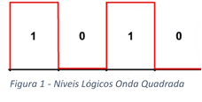
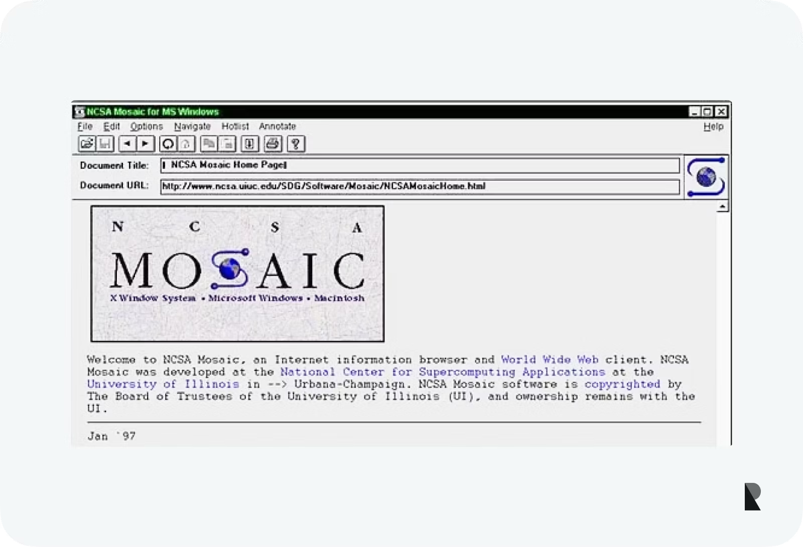
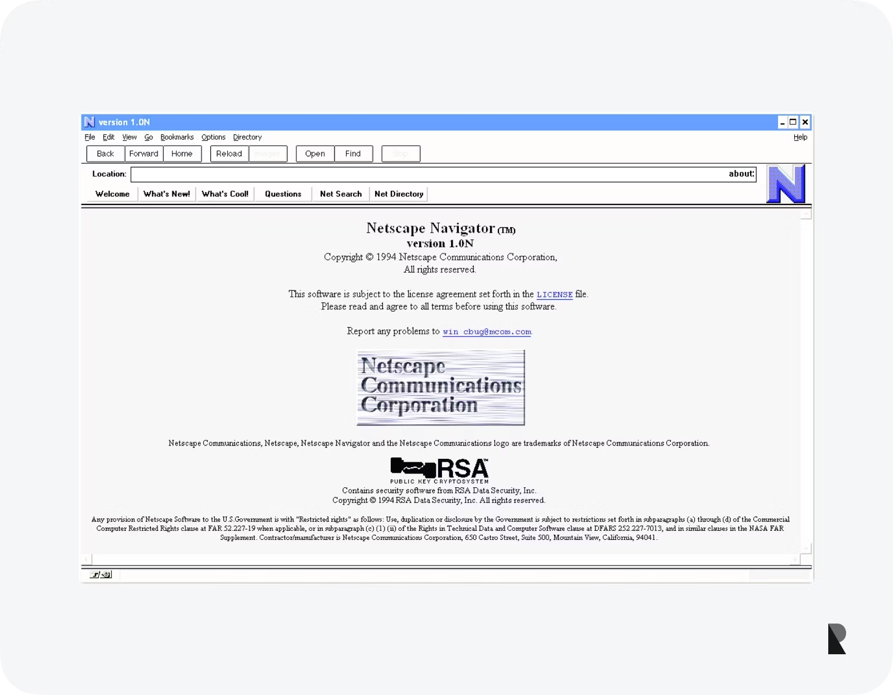
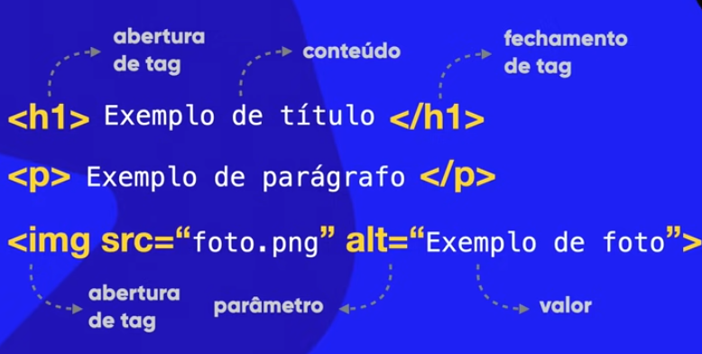
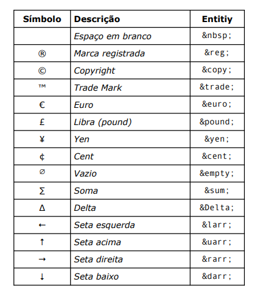

# HTML E CSS
## Repositório pra registro do curso de 5 módulos de HTML e CSS3 do curso em vídeo.
---
### O que vamos aprender? 

#### Módulo 1 - Primeiros passos (cap 1 a 12)
1) Evolução da internet
2) Como Surgiu?
3) Como a internet funciona?
4) Como Funciona os protocolos? 
5) O que é dominio e hospedagem e qual a diferençã?
6) Qual a diferença entre as linguagens HTML, CSS e  JS?
7) Qual a diferença de back end pra front end
8) Como Organizar o Ambiente de desenvolvimento
9) Como fazer a estrutura básica de HTML
10) Porque do posionamento de cada comando
11) Diferença de maiusculas pra minusculas
12) Como Trabalhar com textos 
13) Como colocar símbolos e emojis
14) Como organizar o contéudo de forma hierarquica
15) Vamos entender a semântica de HTML5
16) Aprender a usar links e ancoras
17) Aprender a trabalhar com multimia (vídeos,imagens e aúdios)
18) Como Aplicar estilos nas CSS 

#### Módulo 2 -  Cores (cap 13 a 17)
19) Psicologia das cores 
20) Harmonização de cores
21) Paleta de cores 
22) Tipografia (fontes)
23) Estudos das CSS 
24) variaveis em CSS
25) Modelo de caixas 
26) Criação de site do zero

### Módulo 3 - Do repositório ao site online  (cap 18 a 21)
27) Como hospedar seu site 
28) Configurações de CSS pra imagens de fundo
29) Criação de projeto de Cordel
30) Como trabalhar com tabelas 

### Módulo 4 - páginas web completas, funcionais e responsivas. (Cap 22 a 26)
31) Iframes 
32) Projeto Rede sociais
33) Formulários 
34) Design Responsivos 
35) Projeto tela de login responsiva

### Módulo 5 - Aprofundamento em  técnicas de CSS3 para criar páginas modernas e responsivas (novas tecnlogias)
36) Flexbox
37) Grid Layout
38) Projeto Final

Acesse a pasts questões HTML e CSS, exercícios e Desafios para ver o que foi feito durante o curso
---
- melhores livros pra aprender HTML e CSS
1) Material de apoio - curso em vídeo
2) Rerências on-line
MDN
W3C Standards
Whatwg Living Standard
W3Schools
4) Livros 
Serie O' Reilly 
HTML5 e CSS3 - Um guia prático e visual de html5 e css 3
HTLM e CSS - Projete e constua sites
HTML e CSS - Use a cabeça
Crie seu próprio site 
Fundamentos de HTML5 e CSS 3 - Moujour
HTML5: a Linguagem de Marcação que Revolucionou a Web - Moujour
CSS Grid Layout: Criando Layouts CSS Profissionais - Moujour
CSS3 - Moujour

---
## Módulo 1 - Primeiros passos 

1) Evolução da internet
2) Como Surgiu?
3) Como a internet funciona?

##### História da Internet

A internet surgiu durante a guerra fria, com a URSS lançando um sátelite espacial(Sputinick), para saber a órbita da terra, no entando, os EUA achavam que era algum tipo de sátelite espião. Nessa perspectiva, o governo dos Estados Unidos temia um ataque russo às bases militares. Um ataque poderia trazer a público informações sigilosas, tornando os EUA
vulneráveis. 

Então foi fundado uma agência pra estudos de tecnologias de guerra a DARPA - (Defense Advanced Research Projects Agency) é a agência do Departamento de Defesa dos EUA, com o intuito de proteger informações de um possível ataque.

Com isso, eles criaram uma rede de compartilhamento entres as bases militares a ARPANET. A ARPANET funcionava através de um sistema conhecido como chaveamento de pacotes, que é um sistema de transmissão de dados em rede de computadores no qual as informações são divididas em pequenos pacotes, que por sua vez contém:
• trecho dos dados
• o endereço do destinatário
• informações que permitiam a remontagem da mensagem original. 

Esses sistema, funcionava por meio de um protocolo chamado NCP - Network Control Protocol (protocolo de controle de rede) e de maneira simples tinha o obejtivo de vários computadores falarem a mesma linguagem.

Porém, o NCP tinha um problema de funcionar apenas uma comunicação por vez, ou seja, ao longo de uma transmisão, se outro conputadores quiserem se comunicar tem que esperar o fim da transmissão.

Pra acabar com isso dois pesquisadores criaram dois protocolos que depois foram juntados o TCP/IP 

Bob kahn -> TCP (Transfer control protocol) várias transmissoes 
Vint Cerf - IP (internetwork Protocol) - Indentificador de máquinas 

Com o tempo a ARPANET cresceu tanto que eles resolveram separar ela em três redes.

MILNET - MILITAR 
NFFNET - CIENTÍFICA
Comerciais

Essas redes queriam se conectar em inglês - Interconnect Networking que abreviando fica internetwoking que abreviando de novo fica internet.

##### Como funciona a internet?

1) O computador transfere a informação solicitada por meio de pacotes e enviado para o destinatario (O IP indenfica o destinatario e enviador e o tcp envia os pacotes depois de quebrar a mensagem )

###### O passo a passo da Infraestrura da internet

Primeiramente a internet e dividida em milhas, a primeira é ultima milha server pra tudo que fazemos para nos conectar ou receber informações.

O dispostivo manda os pacotes por meio de ondas de rádio que o receptor (o roteador domestico ou movel), determinar se são 0 ou 1 por meio de uma frequência pré establecida (frequência da modulação). O roteador tem que transformar esses sinais em outras coisas para passar pelos cabos de transmisão até o IPS (provedores de internet)[responsável por achar a melhor rota pra informação]. 

Em muitos contextos esses dispostivos são chamados de modem pois fazem o processos de modulação(de ondas quadradas a ondas sinoidais) e demodulação (de onda sinoidal a quadrada).

Esse motivo e porque ele "junta" esses aparelhos em um só o que chamamos de gateway

Os IPS levam essas informações até os Hubs de Internet, nos hubs de internet e eles repassam pelos ips e devolvem ao destinatario, sempre buscando a rota mais curta. Mas e se essa mensagem sair da região de distribuição de internet dos IPS?

Nesse ponto chegamos as espinhas centrais da internet, por meio de cabos submarinos são interligado os litorais dos paises.

Ok, nesse ponto abrangimos, quase tudo sobre a infraestrutura da internet, mas você deve se perguntar, e aqueles que não tem IPS em suas regiões e não moram e regiões litorâneas? 

Para isso temos meios de trasnmissão de internet para todos como sátelites e balões atmosfericos que funcionam como cabos por meio de ondas de rádio e assim sendo usados como pontos de transmissão.

##### Como era a internet antigamente?

Por meio de um protocolo de navegação chamado gopher, era acessado as informações que o funcionário queria.

Em 1993 um inglês chamado Tim Berness-Lee criou um protocolo que foi incluido mais tarde no TCP/IP o HTTP (HyperText Transfer Protocol) e a linguagem HTML (HyperText Markup Language) e com isso mudou a internet pra uma World Wide Web (rede de alcançe mundial) pois permitia a facilitação do funcionamento da internet.

Outra coisa que foi criado pra internet funcionar foi um navegador (O Mosaic) 

No caso a World Wide Web e uma subrede da internet.

##### Representação de Dados
01- digitato binario -> bit ->  8 bits -> byte (porção minima pra representação de dados) 
Código do teclado atual -> código mulitbyte UTF-8

transfomação e a cada cojunto de 1024
1024 bytes = 1 KB (\(2^{10}\))
1024 KB = 1 MB
1024 MB = 1 GB
1024 GB = 1 TB
1024 TB = 1 PB
1024 PB = 1 EB
1024 EB = 1 ZB
1024 ZB = 1 YB

MB <> Mb (Megabytes[armazenamento] e megabits[transmissão])

##### Voltando a internet o passo a passo

1) computador pede mensagem (requisão) essa mensagem é divida em partes e enviadas em pacotes de bytes 

2) O roteador recebe e transforma em ondas sinoidais para passar pela infrestrutura da internet

3) a mensagem chega no servidor e o servidor devolve a mensagem ou para o cliente ou para destinatario do cliente de forma invesa do processo de envio 

### detalhando o processo (o IP)
-para que se acha as pessoas e locais da internet que as mensagem deve passar e recolher/enviar informações temos o IP (interconnect protocol) que da um número de  x diugitos e informa para outra parte que vamos falar agora.
Os IPs mais modernos (IPv6), usam 128 bits ao todo (o que é 4x mais bits que o
IPv4).
Ex: 2001:0db8:85a3:08d3:1319:8a2e:0370:7344

##### Servidores DNS 
A internet tem uma "agenda eletrônica" que salva os ips em nomes que nem uma agenda de telefone celular, essa "agenda" é chamado de servidor DNS (domain Name system) -Sistemas de nome de dominio, mas aliais o que é dominio?

##### Dominio e hospedagem
 De maneira simples o dominio (nome unico) e o nome de indentificação de um site e hospedagem e onde o site está armazenado(espaço, memória e recusrsos).

 Na URL -Uniform Resource Locator (Localizador Uniforme de Recursos) cada parte dela tem uma função.

 

Extensões finais
 TLD - top level domain (.com, .gov, .io, .edu.br)  
 GTLD - : São TLDs genéricos, sem indicação de país. Alguns dos domínios genéricos são
.com, .net, .gov, .org, .io, .info, .online, .store, etc
ccTLD: São TLDs com designação do país (coutry code). Alguns dos domínios desse
tipo são .com.br, .edu.us, .co.fr, .jp, .es, etc. 

Um subdomínio é um prefixo adicionado ao nome de domínio principal,  serve para organizar, segmentar e gerenciar diferentes áreas de um site de forma independente.

o caminho e literalmente o caminho que o servidor vai recorrer( detalhado em introdução ao desenvolvimento backend)

outro:

Os tipos incluem hospedagem compartilhada, VPS, hospedagem dedicada e hospedagem em nuvem com recursos escaláveis. Os serviços incluem infraestrutura, registro de domínio, segurança e suporte técnico para garantir a disponibilidade confiável do site.

Escolher o tipo certo de hospedagem é como escolher onde morar: depende do quanto você pode pagar e de quanto espaço (ou privacidade) você precisa.

Aqui está uma explicação direta de cada modelo:

1. Hospedagem Compartilhada
É como morar em um apartamento com vários colegas. Todos dividem a mesma cozinha, o mesmo banheiro e as contas.

Como funciona: Vários sites usam os recursos de um único servidor.

Para quem: Sites pequenos, blogs pessoais ou iniciantes que buscam o menor custo.

2. VPS (Servidor Virtual Privado)
É como morar em um condomínio. Você ainda compartilha o prédio, mas tem o seu próprio apartamento com paredes sólidas e controle total da sua porta para dentro.

Como funciona: O servidor é dividido virtualmente. Você tem recursos (RAM, CPU) reservados só para você.

Para quem: Sites que estão crescendo e precisam de mais estabilidade que a compartilhada.

3. Hospedagem Dedicada
É como ter uma mansão de luxo. O terreno e a casa inteira são só seus. Ninguém mais mora lá.

Como funciona: Um servidor físico inteiro é dedicado exclusivamente ao seu site.

Para quem: Grandes e-commerces ou sites com tráfego altíssimo que exigem segurança máxima e performance bruta.

4. Hospedagem em Nuvem (Cloud)
É como uma rede de hotéis. Se um quarto tem problema, você é movido para outro instantaneamente sem perceber.

Como funciona: O site não fica em um só computador, mas em vários interconectados. Se um falha, outro assume.

Para quem: Sites que variam muito o tráfego e precisam de escalabilidade (aumentar recursos rapidamente se houver um pico de acessos).

##### Protocolo HTTP e HTTPS

HTTP (Hypertext Transfer Protocol - Protocolo de Transferência de Hipertexto) é o protocolo fundamental da World Wide Web, criado para transferir documentos hipermídia (como HTML) entre um cliente (navegador) e um servidor. Ele funciona em um modelo cliente-servidor, onde o navegador faz uma solicitação e o servidor responde com os dados da página.

O HTTPS utiliza criptografia para garantir a privacidade e segurança.
##### Como Funciona os navegadores?
Um navegador web é um aplicativo usado para acessar sites na Internet. É um software que permite aos usuários acessar e visualizar conteúdo na World Wide Web. Um navegador web funciona como um tradutor, recebendo informações de servidores web e exibindo-as ao usuário como uma página web. As principais funções de um navegador web são buscar e exibir páginas da web e fornecer uma interface para interação com o usuário.

exemplos: Google Chrome, Mozilla Firefox, Apple Safari, Microsoft Edge e Opera.
###### História dos navegadores da Web
Mosaic (primeiro navegador gráfico da web.)

Netscape Navigator(o primeiro navegador comercial amplamente utilizado.)

Internet Explorer (acesso gratuito com windows)

navegadores modernos (mais popular é o google chrome)

###### O processo dos navegadores 
 Depois de receber os HTML e CSS o navegador renderiza pelo motor de renderização, sendo cada navegador com o seu próprio.

 - Componetes do navegador

Interface do Usuário (IU)
Motor de renderização
Componente de Rede
Mecanismo JavaScript
Componentes de segurança:

- Tipos de navegadores

computador - os mais usados
móveis  - navegação rápida e fácil
Navegadores incorporados - versõesm em miniatura de navegadores da web (ex: navegador pra exubir conteudo do email e pesquisa)

- caracteristicas de navegadores 

navegação por abas
favoritos
historico de navegação
gerenciador de downloads
barra de pesquisa 
personalização da interface do usuario (IU)
extensões e complementos
sincronização
Suporte ao Protocolo de Transferência de Hipertexto (https)
Bloqueador de Pop-ups
Modo de navegação anônima
bloqueio de rastreadores 
sandbox -isolamento de site com o S.O
e etc.............

obs: Cookies são pequenos arquivos de texto, criados por sites e armazenados no seu computador ou celular, que salvam dados sobre sua navegação

##### Como funciona a HTML e as CSS? 

1) Não existe programar em HTML e CSS, exite desenvolve em HTML e CSS

Porque?
HTML e CSS não são linguagens de programação porque são declarativas e focadas em estrutura e estilo, não em lógica ou processamento de dados.

HTML -> Hypertext Markup Language (contéudo)
CSS  -> Cascading Style Sheets (Design)
JS   -> Java Script (interatividade)

extension web developer pra visualização das ferramentas em um site 

###### HTML (contéudo)

você precisa se tags <> (marcações)
exemplo: 
<h1> - abertura de tag (título)
</h1> - fechamento de tag

ex: <h1> Titulo teste </h1>
paragrafo 
 

 alt =" exemplo de foto">

###### Estilo CSS

H1(seletor) {
    font-family:arial {
    font-size: 20pt             declaração
    color(propriedade):blue (valor)        }

}
##### Estrutura básica da HTML

<!DOCTYPE html>  -> vou desenvolver um site em HTML5
<html lang="pt-br"> -> linguagem do site
  <head> -> cabeça
    <title>Título da página</title>
    <meta charset="utf-8">  -> meu site vai ser compativel com o código utf-8
    <meta name="viewport" content="width=device-width, initial-scale=1.0"> -> o site vai ocupar toda a parte branca e vai ocupar na escala de 100%
  </head>
  <body> -> Corpo
    Aqui vai o código HTML que fará seu site aparecer.
  </body>
</html>

###### Tags HTML

obs: apesar do navegador entender a tag tanto em minuscula quanto em maiscula, uma boa prática é escrver todas em minusculas para melhor legibilidade e consistência no código.

obs: Não utlize o br br várias vezes 

<!--> </!--> -- comentario 
<h1> título 

 parágrafo

 linha horizontal 
  pular linha 
Um &lt; estamos pedindo pra colocar o símbolo menor que (less than - menor que ).
Um &gt; estamos pedindo para coloca o símbolo maior que (greater than - maior que ). 
&reg; - coloca & e pesquisa um símbolo do vscode em html ou importa um se não tiver

tabela de opçoes de símbolos (pesquise na documentação se não achar)

Para emojis você pode colar no vscode mais pra funcionar 100% vai em um site de emoji e pegue o código em hexadecimal. Para inserir coloque &#xcodigo  &#x1F596 pra  &#x1F596;
 
 

