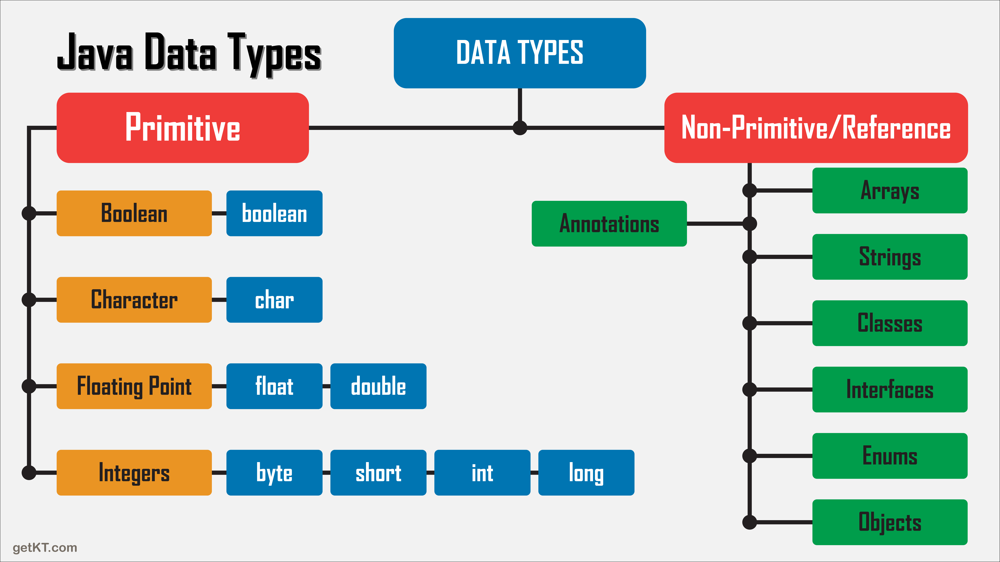

# Estudos Sobre java
## Objetivos 
-Dominar tudo em java a fim de se tornar um desenvolvedor java moderno
### Fontes 
- Java 10x  -Fiasco
- Roadmaph.sh (https://roadmap.sh/java)

---
### Index
- O que é uma IDE?
- Porque usar o IntelliJ IDEA
- Configurações
- Variaveis, tipagem de dados
- Mas o que é uma variavél?
- Tipos de dados (primitivos)
- Tipos de dados não primitivos 
- Principal difença entre dados primitivo e não primitivos ?
- Perguntas relevantes e outros? 
- Comando de Saída em java 

---
- O que é uma IDE?
  IDE significa Integrated Development Environment (Ambiente de Desenvolvimento Integrado). É um software que reúne, em uma única interface gráfica, as ferramentas essenciais para criar, testar, depurar (debugar) e compilar código, aumentando a produtividade dos programadores.

- Porque usar o IntelliJ IDEA
  IntelliJ IDEA é amplamente considerado a melhor IDE para Java e Kotlin devido à sua análise de código inteligente em tempo real, refatoração robusta, excelente suporte a frameworks (Spring, Jakarta EE) e navegação rápida, aumentando a produtividade e a qualidade do código

  principal motivo: muito autonomia no autocomplete, ou seja ele facilita na hora da escrita de código.

- Configurações
  Ao Longo do aprendizado vou registrar os atalhos de uso da ferramenta que achei aqui.

- Variaveis, tipagem de dados

Primeiramente, vale resaltar que java é uma linguagem fortemente tipada, o que é isso? (ma linguagem fortemente tipada (ou altamente tipada) é aquela que impõe regras rigorosas sobre os tipos de dados (como int, string, bool), não permitindo conversões automáticas implícitas entre tipos incompatíveis e exigindo que tipos de variáveis sejam bem definidos.)

- Mas o que é uma variavél?

De maneira simples é um espaço na mémoria do computador onde vamos guardar os nossos dados e podemos alocar valores nesses espaços(letras, números e etc)

Pra poder declarar valores pra variavéis em java ou seja atribuições, devemos colocar o sinal de = e um ponto e vígula (;) depois do valor atíbuido para saber onde finaliza aquele trecho de código.

exemplo: idade = 16;
         altura = 1.64;
         vivo ou morto = true;

- Tipos de dados (primitivos)

obs: São tipos de dados que de maneira geral não recebem métodos de maneira padrão.

1) caractere
char - pra armazenar um único caractere

2) int(Números inteiro) - valor máximo 2 147 483 647 
sub dados 
long - com sinal de 64 bits usado para armazenar números inteiros grande (9.223.372.036.854.775.807)[o atribuir um valor literal a uma longvariável, você deve acrescentar um L(ou minúsculo l, embora maiúsculo seja preferível para maior clareza) para informar ao compilador que o número é um longe não um algarismo int]

byte: Números inteiros pequenos.

short: Números inteiros menores que um int.

3) Double(Números reais) -  úmeros de ponto flutuante de precisão dupla.
float: Números de ponto flutuante de precisão simples.

4) Boolean (lógico - true e false)

- Tipos de dados não primitivos 

obs: São tipos de dados em que pode-se colocar metódos para fazer alterações na variável sem que seja mudado seu escopo.

1) string(caractere) - aramzenar um nome 
2) array(lista encadeadas)[variável composta homogênea] -Estruturas para armazenar múltiplos valores em uma única variável.
3) Class - (também conhecida como campo estático) é um atributo declarado com a palavra-chave static dentro de uma classe, mas fora de qualquer método
4) enuns
5) objects -Instâncias de classes que encapsulam dados e comportamentos. 
6) interfaces

- Principal difença entre dados primitivo e não primitivos ?

poder usar métodos nas variáveis.

- O que são métodos ?
 São carcteristicas que colocamos dentro de variáveis. um método em Java é uma função, mas com a particularidade de estar obrigatoriamente associado a uma classe ou objeto

- Qual a vantagem de ter uma linguagem fortemente tipada? 
Aumenta a segurança do código, previne erros de lógica, melhora a legibilidade e facilita a manutenção, sendo muito utilizada em sistemas de grande porte.

- Perguntas relevantes e outros? 
O que é um package: uma pasta pra organizar classes e interfaces relacionadas a um único grupo.

O que é uma class: é um molde de criação de código

O que é um boilerplate?: Uma formúla de bolo toda vez que cria um projeto.

psvm - public static void main

atalho - sout para escrever System.out.println mas rápido
 e cntrl r pra executar a aplicação

Principais Shortcuts
No Windows:

Ctrl + Shift + A: Encontrar e executar qualquer ação
Ctrl + E: Mostrar arquivos recentes
Ctrl + /: Comentar/descomentar linha
Ctrl + Shift + F10: Executar a aplicação

- Comando de Saída em java 

System.out.print - mostra para o usuário na tela
System.out.println - mostra para o usuário na tela e pula uma linha 
