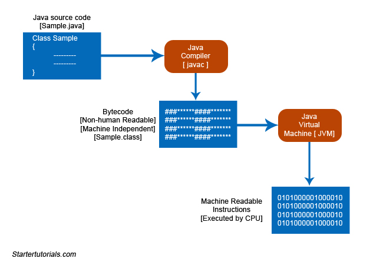
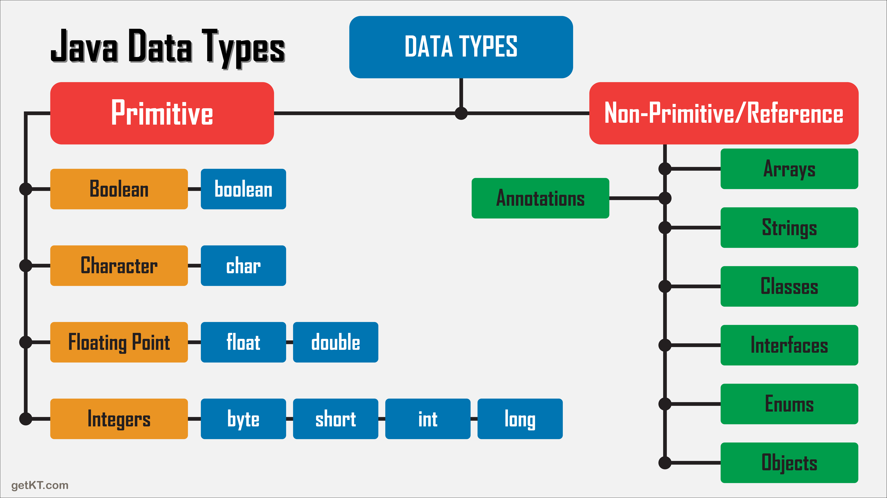
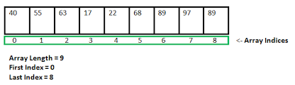
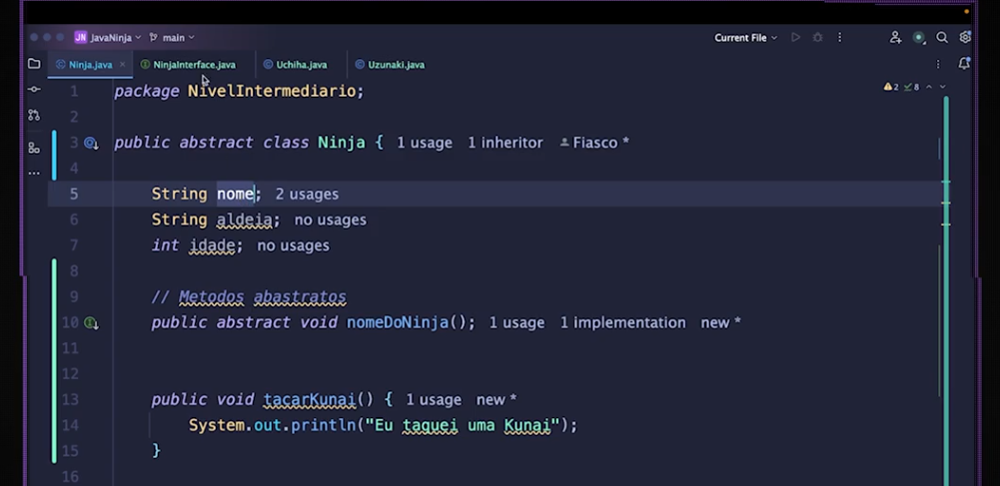
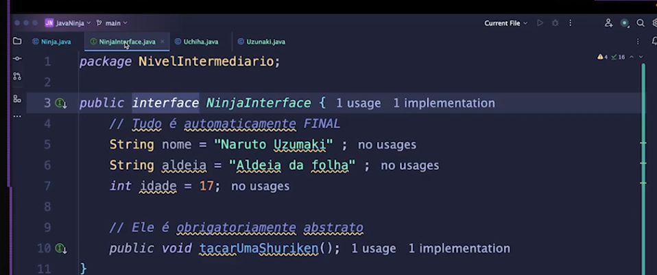
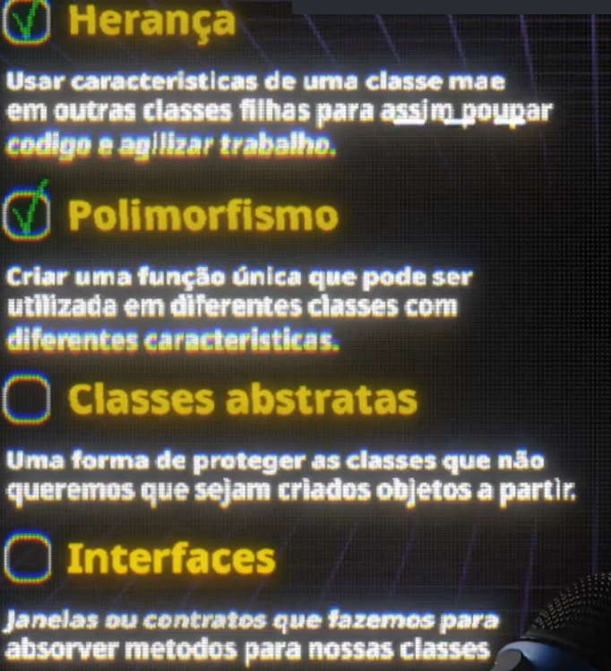
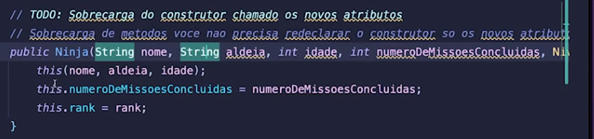
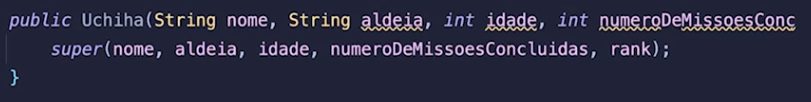
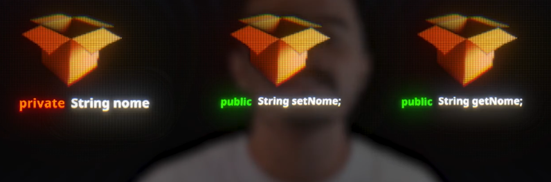

# Estudos Sobre java
## Objetivos 
-Dominar tudo em java a fim de se tornar um desenvolvedor java moderno
### Fontes 
- Java 10x  -Fiasco
- Roadmaph.sh (https://roadmap.sh/java)

---
- O que é uma IDE?

  IDE significa Integrated Development Environment (Ambiente de Desenvolvimento Integrado). É um software que reúne, em uma única interface gráfica, as ferramentas essenciais para criar, testar, depurar (debugar) e compilar código, aumentando a produtividade dos programadores.

- Porque usar o IntelliJ IDEA?

  IntelliJ IDEA é amplamente considerado a melhor IDE para Java e Kotlin devido à sua análise de código inteligente em tempo real, refatoração robusta, excelente suporte a frameworks (Spring, Jakarta EE) e navegação rápida, aumentando a produtividade e a qualidade do código

  principal motivo: muito autonomia no autocomplete, ou seja ele facilita na hora da escrita de código.

- Configurações
  Ao Longo do aprendizado vou registrar os atalhos de uso da ferramenta que achei aqui.


#### Ciclo de vida de um programa JAVA



Existem três estágios principais no ciclo de vida de um programa Java.  São eles:
1) Editando o programa
2) Compilando o código-fonte
3) Executando o código de bytes

1- Primeiro, você começará digitando o programa em um O processo começa com os desenvolvedores escrevendo o código-fonte Java em .javaarquivos usando uma IDE ou um editor de texto.

2-  Esse código é então compilado pelo compilador Java (javac) em bytecode armazenado em .classarquivos, com verificação de sintaxe e tipo realizada durante a compilação.

3- A última etapa é a execução.  O bytecode gerado pelo compilador será executado pela  Máquina Virtual Java (JVM) . A entrada para a JVM é bytecode e a saída é código de máquina (0s e 1s) que será executado pela CPU da máquina local.

Sobre a JVM?

Quando o programa é executado, a Máquina Virtual Java (JVM) carrega esses arquivos de classe compilados na memória por meio de um processo que envolve o carregamento de dados binários, a vinculação para verificação e preparação e a inicialização dos elementos da classe. A JVM então verifica a conformidade de segurança do bytecode, realiza a compilação Just-In-Time (JIT) para traduzir o bytecode em código de máquina nativo para melhor desempenho e executa as instruções do programa enquanto gerencia os recursos do sistema. Ao longo da execução, a JVM lida com a coleta de lixo, recuperando a memória de objetos não utilizados e, finalmente, libera todos os recursos ao término do programa.

 Essa arquitetura permite a capacidade do Java de "escrever uma vez, executar em qualquer lugar", já que o bytecode pode ser executado em qualquer dispositivo com uma JVM compatíve

observações:

obs: compiilador é um programa de computador que traduz o código-fonte (escrito em uma linguagem de programação de alto nível, como C, C++ ou Rust) para uma linguagem de baixo nível( aquelas com pouca ou nenhuma abstração em relação ao hardware), como código de máquina ou assembly, que pode ser executado diretamente pelo processador.

O bytecode é uma representação intermediária de código, posicionada entre o código-fonte de alto nível (como Java ou Python) e o código de máquina que uma CPU física entende.Ele foi projetado para ser executado por uma Máquina Virtual (JVM)


Detalhamento do processo da JVM no Futuro.


#### Variaveis, tipagem de dados

Primeiramente, vale resaltar que java é uma linguagem fortemente tipada, o que é isso? (ma linguagem fortemente tipada (ou altamente tipada) é aquela que impõe regras rigorosas sobre os tipos de dados (como int, string, bool), não permitindo conversões automáticas implícitas entre tipos incompatíveis e exigindo que tipos de variáveis sejam bem definidos.)

- Mas o que é uma variavél?

De maneira simples é um espaço na mémoria do computador onde vamos guardar os nossos dados e podemos alocar valores nesses espaços(letras, números e etc)

Pra poder declarar valores pra variavéis em java ou seja atribuições, devemos colocar o sinal de = e um ponto e vígula (;) depois do valor atíbuido para saber onde finaliza aquele trecho de código.

exemplo: idade = 16;
         altura = 1.64;
         vivo ou morto = true;

- Tipos de dados (primitivos)

obs: São tipos de dados que de maneira geral não recebem métodos de maneira padrão.

1) caractere
char - pra armazenar um único caractere

2) int(Números inteiro) - valor máximo 2 147 483 647 
sub dados 
long - com sinal de 64 bits usado para armazenar números inteiros grande (9.223.372.036.854.775.807)[o atribuir um valor literal a uma longvariável, você deve acrescentar um L(ou minúsculo l, embora maiúsculo seja preferível para maior clareza) para informar ao compilador que o número é um longe não um algarismo int]

byte: Números inteiros pequenos.

short: Números inteiros menores que um int.

3) Double(Números reais) -  números de ponto flutuante de precisão dupla.
float: Números de ponto flutuante de precisão simples.

4) Boolean (lógico - true e false)

- Tipos de dados não primitivos 

obs: São tipos de dados em que pode-se colocar metódos para fazer alterações na variável sem que seja mudado seu escopo.

1) string(caractere) - aramzenar um nome 
2) array(lista encadeadas)[variável composta homogênea] -Estruturas para armazenar múltiplos valores em uma única variável.
3) Class - (também conhecida como campo estático) é um atributo declarado com a palavra-chave static dentro de uma classe, mas fora de qualquer método
4) enuns
5) objects -Instâncias de classes que encapsulam dados e comportamentos. 
6) interfaces

- Principal difença entre dados primitivo e não primitivos ?

poder usar métodos nas variáveis.



- O que são métodos ?

 São carcteristicas que colocamos dentro de variáveis. um método em Java é uma função, mas com a particularidade de estar obrigatoriamente associado a uma classe ou objeto.No caso, para ativar um método em uma varivel, basta colocar um ponto sobre a váriavel declarada e escolher um método java ou próprio

- Qual a vantagem de ter uma linguagem fortemente tipada? 

Aumenta a segurança do código, previne erros de lógica, melhora a legibilidade e facilita a manutenção, sendo muito utilizada em sistemas de grande porte.


- Perguntas relevantes e outros? 

O que é um package: uma pasta pra organizar classes e interfaces relacionadas a um único grupo.

O que é uma class: é um molde de criação de código

O que é um boilerplate?: Uma formúla de bolo toda vez que cria um projeto.

psvm - public static void main 
psvma  -public static void main string args

atalho - sout para escrever System.out.println mas rápido
 e cntrl r pra executar a aplicação

Principais Shortcuts
No Windows:

Ctrl + Shift + A: Encontrar e executar qualquer ação
Ctrl + E: Mostrar arquivos recentes
Ctrl + /: Comentar/descomentar linha
Ctrl + Shift + F10: Executar a aplicação

### Sintaxe básica 

- Comando de Saída em java 

System.out.print - mostra para o usuário na tela
System.out.println - mostra para o usuário na tela e pula uma linha 

- Comando de Entrada em Java 

Scanner - toda vez que você abre essa caixa tem que fechar (palavra reservada)

um unico scanner pode trabalhar com diferentes tipos de dados 

Scanner nomeDoScanner = new Scanner(System.in);

Scanner → tipo da variável

nomeDoScanner → nome que você escolheu

new Scanner(System.in) → cria um scanner para receber dados do teclado

Explicando:

new Scanner(System.in)

new → cria um novo objeto

Scanner → classe usada para ler entradas do usuário

System.in → entrada padrão do sistema (teclado)

#### Fundição de tipos (typecasting)

Consiste em converter um tipo de dado em outro, sendo útil quando precisamos realizar operações com diferentes tipos de dados ou quando queremos armazenar um valor de um tipo de dado em uma variável de outro tipo de dado. 

De maneira simples e atribuição do valor de uma variavel de um tipo para outra:

````
     int numero = 18; // criando varivael de tipo maior

        double valor = numero; // convertendo o tipo

        System.out.println("Número: "+ numero);
        System.out.println("Valor: "+ valor);

````

Existem milhares de conbinações possíveis de fundição de tipos, entretanto elas sempre seguem um dos dois padrões 


- Fundição do tipo alargado:

A conversão de tipo por ampliação (widening type casting) é o processo de converter um tipo de dado inferior para um tipo de dado superior. Também é conhecida como conversão implícita ou casting para baixo. Esse processo é realizado automaticamente e é seguro, pois não há risco de perda de dados. Esse tipo de conversão de tipo em Java ocorre quando:

O tipo de destino é maior que o tipo de origem.
Os dois tipos de dados são compatíveis.
byte -> short -> char -> int -> long -> float -> double (Da esquerda para a direita: Tipo de dado inferior para tipo de dado superior)

exemplo relatado acima 


- Fundição de Tipo Estreito:

A conversão de tipo por redução (ou "thresholding type casting") é o processo de reduzir um tipo de dados maior para um menor. 
Em Java, esse processo também é conhecido como conversão ascendente (ou "casting up") ou conversão explícita de tipo. 
Ele não ocorre automaticamente. Se não for feito explicitamente, ocorrerá um erro de compilação. 
A conversão de tipo por redução é insegura, pois pode haver perda de dados devido ao menor intervalo de valores permitidos para o tipo de dados inferior. 
Um operador de conversão (`cast`) auxilia na conversão explícita.

double -> float -> long -> int -> char -> short -> byte (Da esquerda para a direita: do tipo de dado mais significativo para o mais abstrato)

exemplo:
````
   int numero = 130;

        byte valorByte = (byte) numero; // int → byte

        System.out.println(valorByte);
````       

#### Escopo de variaveis 

Em java existem varios tipos de escopos de variaveis mas ele sempre é centrado em escopo local e escopo global

O escopo global e odo o código presente, no caso em java a class, já o escopo local e aquela parte especifica do código onde apenas ali existe aquela variavél.

Os Escopos locais que existe em java são:

1) Escopo da classe - variaveis declarada dentro da classe
2) Escopo do método - variavel existe apenas no método
3) Escopo do Loop - variavel existe apenas dentro do loop
4) suporte para mira telescopica - variavel dentro de concheltes que apenas pode ser executada ali
5) Escopos e sombreamento de variavel -  uma má pratica de programação onde temos uma variavel da classe e do método do mesmo nome e assim acabamos instanciando duas variaveis, nesse caso se quiser acessar a global pelo método se usar this em subclasses e super e superclasses.

````
public class NestedScopesExample {
    String title = "Baeldung";
    public void printTitle() {
        System.out.println(title);
        String title = "John Doe";
        System.out.println(title);
    }
}
````


##### métodos

É a sequência de passos colocadas dentro de uma escopo de uma classe, podendo ser do tipo void - não retorna valor(procedimento) e return - retorna valor(função)

nextLine(); // recebe texto

nextInt();  // recebe inteiro

#### Operadores matematicos básicos 

Adição - + 

subtração - (-)

Divisão  - / 

Multiplicação - *

Restante/ Módulo -  %

para saber outros operadores acesse a documentação oficial ou tutoriais (https://jenkov.com/tutorials/java/math-operators-and-math-class.html)

#### Condicionais 

IF - se 

ELSE - Senão

ELSE-IF = se encadeado

Swicht case - escolha caso (precisa colocar o Break no final do case) ((não pode usar tipo lógico))

?: ternário- maneira pra enxugar o código (if e else junto)


- Qual a maior diferença de JAVA pra JS e porque é mais complicado que algumas linguagens?

Java é considerada mais complicada porque:

Tem muita regra;
precisa entender orientação a objetos cedo;
é mais verbosa (escreve mais código);
o compilador reclama de tudo;
exige organização desde o começo.
obs: pra determinar o fim do comando precisa colocar ; 

#### Laços de repetição (sempre inclemente o que está trabalhando)

1) while (enquanto) - repete sempre um a mais 
````
public class Main {
    public static void main(String[] args) {

        int contador = 1;

        while (contador <= 5) {
            System.out.println("Número: " + contador);
            contador++;
        }

    }
}
````
2) For (para) -for(inicialização; condição; incremento) { // código }
````
// Program to print a text 5 times

class Main {
  public static void main(String[] args) {

    int n = 5;
    // for loop  
    for (int i = 1; i <= n; ++i) {
      System.out.println("Java is fun");
    }
  }
}
````
3) do..while(faça enquanto) - executa o código uma vez e depois verifica
`````
public class Main {
    public static void main(String[] args) {

        int numero = 10;

        do {
            System.out.println("Executou!");
            numero++;
        } while (numero < 5);

    }
}
`````
4) ForEach (para cada)
````
// print array elements 

class Main {
  public static void main(String[] args) {
      
    // create an array
    int[] numbers = {3, 7, 5, -5};
    
    // iterating through the array 
    for (int number: numbers) {
       System.out.println(number);
    }
  }
}
````

#### Arrays (Matrizes)

 São estruturas de dados fundamentais usadas para armazenar uma coleção de elementos do mesmo tipo de dados em locais de memória contíguos. Eles fornecem uma maneira de organizar e acessar múltiplos valores usando um único nome de variável e um índice.

 

 Estrutura array unidimensionais 

 String[] ninja = new String[3];

 -String - tipo do elemento

 -ninja - nome do array

 -new - criar novo espaço de objeto de mémoria memória do computador

 -[3] - tamanho do array

 Dados não primitivos também podem ser chamados de tipo de referência pois precisamos alocar um pedaço da mémoria do computador pra esse array, ou seja, vamos ter que referenciar uma memória pra ele.

 Ordenação começa com 0 (index)

 null - Não tem nada pra devolver 

 cada array tem um resultado diferente dependendo do tipo (ex: tipo string da null e tipo int da 0 se não tiver nada no espaço)[inicialização].

 array <> lista 

 O array sempre vai ter um  tamanhos fixo a lista não.

 Inicialização Implícita: Quando o array é declarado, os valores são automaticamente atribuídos com base em seu tipo, economizando a necessidade de inicializar cada elemento individualmente.

Inicialização Explícita: É possível inicializar o array com valores específicos no momento de sua criação, como int[] numeros = {1, 2, 3, 4};. Isso evita o uso dos valores padrões.

###### arrays multimdimencionais 
conhecido como array de array ou array 2D ou matriz.

String[][] ninjasEaldeias = new String[3][3];
é uma matriz 

###### Garbage collector 

Garbage Collection (GC) é o processo automático de gerenciamento de memória, onde objetos que não estão mais em uso são removidos da memória. Isso ajuda a evitar vazamentos de memória.

O Garbage Collector monitora objetos que não têm mais referências ativas e os limpa da memória.
Durante a sobre escrita, o Garbage collector retira momentaneamente o array declarado e cria um novo com o mesmo parâmetro

O Garbage Collection é especialmente importante em linguagens como Java e C#, onde a memória é gerenciada automaticamente.

- Resumo do básico de java 

https://www.mindmeister.com/app/map/3958307975

o que falta colocar  : basico de poo e basica sintaxe  do bufferBufferedReader.


## Nível intermediário

Obs: tudo no java é um objeto - maneiras que pode trabalhar e manipular .

Todo objeto é feito atráves de um molde (class).

No caso do java, você cria uma nova class(molde) no mesmo package e depois inicializamos esse molde em um objeto  em outro class.

````
molde 

package NivelIntermediario;

public class Ninja {
        String nome;
        String aldeia;
        int idade;

    
}


objeto trabalhado

package NivelIntermediario;

public class Main {
    static void main(String[] args) {


        // Criar ninja Naruto - Naruto é um objeto
        String nome ="Naruto Uzumaki";
        int idade = 18;
        String aldeia = "Aldeia da folha";
        System.out.println("Nome do ninja é "+ nome);

        // Criar ninja Sasuke - Sasuke é um objeto

        Ninja sasuke = new Ninja();

        sasuke.nome = "Sasuke Uchiha";
        sasuke.aldeia="Aldeia da folha";
        sasuke.idade =18; 
    }
}

````

vale resaltar que todas as variáveis declaradas dentro de um class a fim de dar caracteristicas a um objeto ém chamado de atributo.
### Orientação a objeto 

A Programação Orientada a Objetos (POO) é um paradigma(Um paradigma de desenvolvimento define o conjunto de crenças, conceitos e metodologias que guiam a forma como os profissionais abordam a criação de algo em desenvolvimento que organiza o código em "objetos" — que combinam dados e comportamentos. Ela é amplamente utilizada porque facilita a criação de sistemas complexos, promove a reutilização de código e torna a manutenção muito mais eficiente

Primeiramente, quais os pilares da orientação a objeto: Emcapsulamento,Herança e Polimorfismo.


1) herança

Usar caracteristicas de um class mãe em outras classes filhas para assim poupar codigo e agilizar trabalho.


pra isso é importante usar a palavra chave da herança na nossa classe - extends.

obs: ao usar a herança a ordem sequencial mostrada das variveis será com base a class mê/pai

obs: sobrescrição de métodos consiste em repitir o método da class mãe no filho adicionando o metódo na class filho


````
package NivelIntermediario;

public class Main {
    static void main(String[] args) {


        // Criar ninja Naruto - Naruto é um o Objeto 1
        Uzumaki naruto = new Uzumaki();

        naruto.nome = "Naruto Uzumaki";
        naruto.aldeia="Aldeia da folha";
        naruto.idade =18;
        naruto.AumentoDechakra();


        

        // Criar ninja Sasuke - Sasuke é um objeto 2

        Uchiha sasuke = new Uchiha();

        sasuke.nome ="Sasuke Uchiha";
        sasuke.idade = 18;
        sasuke.aldeia ="Vila da Folha";
        sasuke.ShariganAtivado();c
    }

````


2) Polimorfismo

Criar uma função unica (trecho de código[algoritmos]) que pode ser utilizada em diferentes classes com diferentes caracteristicas.

Polimorfismo permite que objetos de diferentes classes sejam tratados como objetos de uma classe base comum, o que facilita a criação de código flexível e reutilizável.

no caso você vai sobrescrever  o método que quer reutilizar em uma classe que você vai usar, pra isso use a o método @Override


```
package NivelIntermediario.Polimorfismo;

public class Uchiha extends  Ninja {


    // sobrescrever a classe ninja pelo uchiha - polimorfismo
    @Override
    public void habilidadeEspecial(){
        System.out.println("Meu nome é "+ nome+ " e esse meu uchiha, um ataque de fogo");

    }
}
```


3) Emcapsulamento 
Capacidade de proteger variaveis e classes para que não haja vazamento e mantendo assim protegida e encpsulada nossos objetos. (evitar vazamento de dados)


### Métodos e parâmetros 

Existem dois Tipos de métodos:

1) Void -  Não precisa retornar nada pra gente (procedimento)

````

public class Pessoa {

    // Método PÚBLICO e VOID (não retorna nada, apenas executa a ação)
    public void cumprimentar(String nome) {
        System.out.println("Olá, " + nome + "! Tudo bem?");
    }

    public static void main(String[] args) {
        // Criando o objeto da classe Pessoa
        Pessoa alguem = new Pessoa();

        // Chamando o método público void
        alguem.cumprimentar("Carlos");
    }
}
````


2) Return -  Precisa retornar um valor pra gente (função)(return) e tem que ter um tipo de dado específico(qualquer tipo)

outra coisa que podemos usar parâmetros( as declarações dentro dos parenteses dos métodos) ou seja o método vai acontecer se você me passar o valor do parãmetro

````

// Exemplo de métodos e parâmetros
public class Calculadora {

    // Método para somar dois números
    public int somar(int a, int b) {
        return a + b;
    }

    // Método para subtrair dois números
    public int subtrair(int a, int b) {
        return a - b;
    }

    // Método para multiplicar dois números
    public int multiplicar(int a, int b) {
        return a * b;
    }

    // Método para dividir dois números
    public double dividir(double a, double b) {
        if (b != 0) {
            return a / b;
        } else {
            System.out.println("Não é possível dividir por zero.");
            return 0;
        }
    }

    public static void main(String[] args) {
        Calculadora calc = new Calculadora();
        
        // Chamando os métodos e passando parâmetros
        int soma = calc.somar(5, 3);
        int subtracao = calc.subtrair(10, 4);
        int multiplicacao = calc.multiplicar(7, 6);
        double divisao = calc.dividir(20, 4);
        
        // Exibindo os resultados
        System.out.println("Soma: " + soma);
        System.out.println("Subtração: " + subtracao);
        System.out.println("Multiplicação: " + multiplicacao);
        System.out.println("Divisão: " + divisao);
    }
}
    
````


Etapas pra criação de método personalizado.

1- Colar o método como público para que as outras class possam receber 

2- colocar o tipo de método utilizado

3- colocar nome do método e parenteses(pra indicar que é um método)

4- aplicar no objeto trabalhado o método

### Interfaces

Ela seria como uma janela/portal - Interfaces permitem que você especifique métodos que uma classe deve implementar, sem definir como esses métodos são executados.

*implementes - obrigatoriamente tem que tirar algo de dentro da interface (todos)

obs: sempre de preferência de trabalhar com interfaces no lugar de classes.

obs: Todos os atributos de uma interface são públicos por padrão.

relembrando: Atributos são variáveis ​​que armazenam dados sobre um objeto

interface :

```
package NivelIntermediario;

public interface HyugaUzumaki {

    void AtivarOKarma();
    
    void AtivarJougan();

}
```

classe boruto 
}
```
package NivelIntermediario;

public class Boruto extends Uzumaki  implements  HyugaUzumaki{
    

   public void AtivarOKarma(){
        System.out.println("O Karma foi ativado! Eu sou um Hyuga Uzumaki ");
    }

    
    public void AtivarJougan(){
        System.out.println("O Jougan foi ativado! Eu sou um Hyuga Uzumaki");
    }
    
}

```
implementando na Main


```
// Criar Boruto - Boruto é um Objeto 5

        Boruto Boruto = new Boruto();
        Boruto.nome = "Boruto  Hyuga Uzumaki";
        Boruto.aldeia = "Aldeia da Folha";
        Boruto.idade = 9;
        Boruto.AumentoDechakra();
        Boruto.AtivarJougan();
        Boruto.AtivarOKarma();


```

pense na interface como um um contrato, onde eu posso aceitar ou não esse contrato e caso aceite eu tenho que seguir as regras (usar as variveis e os metodos [dando corpo aos métodos])

### Construtores - Organizando e padronizando objetos

 moldes dentros dos moldes (class) - criação de padrão que todos que forem trabalhar com aquele objeto vai usar.

 obs: toda vez que você cria uma nova classe o java entende que você quer criar um objeto a partir dessa classe.


 - Tipos de construtores

 1) NoArgs Constructor

 Um construtor que vem vazio , não necessariamente recebe argumento nenhum.

 2) AllArgs Constructor

 um constructor que é preenchido como todos os atributos de classe - com argumentos.

 ---

 obs:  Um argumento em Java é o valor real (dados) que você passa para um método quando o invoca.

 Pra ficar menos abstrato, vamos pro exemplo:

 ```
  public class Hokages {

    String nome;

    // construtor com argumento
    public Hokages(String nome){
        this.nome = nome;
    }

    public static void main(String[] args) {

        Hokages hokage1 = new Hokages("Naruto");

        System.out.println(hokage1.nome);
    }
}

  ```

  você está pendindo que todo objeto que  for criado a partir dessa classe, pode ter um construtor, com o usario inserindo o nome do objeto.

  This - referência esse atributo( variáveis ​​que armazenam dados sobre um objeto) declarado na class e o atributo recebe como valor o parametro(declarações dentro dos parenteses dos métodos) do constrututor.


obs: geralmente você coloca todos os argumentos do construtor
shortcut - alt+ insert = criar construtor(1, nenhum ou todos)

obs: o nome do construtor deve ser igual ao nome da class

dica: toda vez que inicializou um construtor ele se toran imutavel, no caso você faz a sobrecarga de métodos


### Classes abstratas 

Serve para padronizar o código. Elas funcionam como moldes ou "contratos" genéricos para outras classes, permitindo compartilhar comportamentos comuns e exigindo que classes filhas implementem métodos específicos(superclasse)

esclabilidade de manuntenção e o principal fator pra usar classes abstratas

Por exemplo : se eu crio uma classe principal(superclasse) Main e uma ninja e deixo a ninja abstrata, eu sou obrigado a criar um subclasse pra criar objetos(instanciar) e pra trabalhar na classe main.

- Caracteristicas de classes abstratas

1)  Elas não pode ser instanciadas  - não pode criar um objeto a partir dela 

2) metodos abstratos não pode ter escopo

- Qual a difernça de uma classe abstrata e uma interface?

Primeiramente vamos as semelhanças, as duas é inpossível criar (instanciar)um objeto. (em termos leigos ela não poderia "procriar")

A principal é que você não pode colocar os atributos (variveis que atuam como caracteristicas dos objetos), sem declarar o valor na interface pois ela é automaticamente final enquanto na classe abstrata você pode.




 
### Super classes x Sub Classes 

A classe mãe chamamos de Super classe pois ela gera outras classes que chamamos de subclasse.

Porém se eu quiser usar um construtor eu vou ter que instanciar (criar) nas subclasses😑😑😑😑

Pra resolver isso eu tenho que sobrescrever o construtor na subclasse e usar a palavra reservada no seu body

o super, e no caso pra superclasse usamos this pra referenciar os atributos da superclasse e o super pra refenciar os atributos da subclasse.   

### Herança Multipla

Para obter os benefícios da herança múltipla, uma classe pode implementar múltiplas interfaces separadas por vírgula utilizando a palavra-chave implementes

```
javapublic interface Voador {
    void voar();
}

public interface Nadador {
    void nadar();
}

// Classe que implementa múltiplas interfaces (herança múltipla de tipos)
public class Pato implements Voador, Nadador {
    @Override
    public void voar() {
        System.out.println("O pato está voando.");
    }

    @Override
    public void nadar() {
        System.out.println("O pato está nadando.");
    }
}
```

- relembrando 



### Overload - Sobrecarga de métodos 

Usamos quando queremos refatorar o código (construir de novo o código ou consertar)

dica: toda vez que tiver uma nova função de trabalho (task) comente o código (use TODO)

pra fazer isso você usa um construtor e referência o anterior com this.() e acrescenta os outros em superclasses e nas subclasess o próprio inteliIDEA faz por você




### enuns

Serve pra colocar atributos que não se alteram como dias da semana, status de pedidos, cargos e etc.

obs: colocar em letras maiscúlas com enum

### Overload/Sobrecarga de metodos

Pra que repetir um método ma interface? a resposta é bem simples pra eu poder usar um método sem parametros e outro com paramêtros, além de eu guardar um único espaço na memória pra esse método

exemplo: 
```
   package NivelIntermediario.Polimorfismo;

public interface EstrategiaDeBatalha {

    void estrategiaNinja();

    void  inteligenciaDeCombate();

    void  inteligenciaDeCombate(int qi);


}
em outra classe:


// sobrecarga de método inteligenciaDeCombate(); padrao
         public void  inteligenciaDeCombate(){
                 System.out.println(" Essa é minha inteligência de combate ");
         }
        // sobrecarga de método inteligenciaDeCombate();
        public void  inteligenciaDeCombate(int qi){
                System.out.println(" Essa é minha inteligência de combate ");

                if (qi > 150 ){
                        System.out.println("Seu QI de batalha é "+ qi + " e você é genio");
                }else if (qi >= 130){
                        System.out.println("Seu QI de batalha é "+ qi + " e você é ninja promissor");
                }else {
                        System.out.println("Seu QI de batalha é "+ qi +" e você é precisa treinar mais suas estrátegias ");
                }
        }

```

depois pra usar ele e só instanciar o método no objeto e colocar o valor do parãmetro
 

 ### Dúvida Frequente -  @Override(sobrescrito) como funciona de verdade?     

 O Override é uma convenção (padronização[boa prática]), que serve pra evitar a criação de novos métodos por erros de digitação, pois ela "autoriza" a escrita daquele método pois, está correto.

 no geral ele deixa mais legibilidade e claro seu código.


### Referência de memória x Valor em memória

Toda vez que cria um objeto eles tem uma referência em memória(lugar na memória do computador ).

ex:NivelIntermediario.Polimorfismo.Uzumaki@4a574795 

Para eu especificar qual valor da memória eu quero mostrar ou "puxar" eu devo indicar o atributo (variavél caracteristica do objeto) que quero mostrar.

Ou seja a referência de memória é o "mapa" enquanto o valor da memória é a "rua".

Se quisermos ter uma representação textual da mémoria, podemos usar o método toString que serve pra converter um objeto ou valor em sua representação textual.

Caso eu queira mudar o método toString adicionando caracterisiticas novas ao método eu posso sobreescrever o método e mudar ele da minha maneira.

````
 @Override
        public String toString() {
                return"Esse é o método toString para referência de  memória" ;
        }

````        

obs: é indicado ter um @override do toString 


### Final Methods - Deixando os métodos constantes

Um método declarado com a palavra-chave **final** não pode ser sobrescrito por subclasses. Isso é útil quando se deseja garantir que a implementação de um método permaneça inalterada em classes derivadas.

````
// Todo ninja vai fazer obrigatoriamente
        final void tacarkunai (){
                System.out.println("Eu sou um metódo da classe filha");
        }


````

Além de métodos Final você pode ter também argumento final.

````
   final double altura = 1.78;
````
obs:  na interface  todos os atributos são final ou seja tem que colocar o valor na hora 

Além de métodos, argumentos também podemos colocar isso na classe, o que faz ela não poder ser instanciada ou seja não pode criar objetos nela.

### Final Class - Deixando as Classes constantes 

Onde usar Final ? 
cpf, rg, id da empresa e etc 

Pra impedir de uma classe seja extendida (herdar)

A diferença da classe final eu posso criar objetos nelas e não posso extender ela  enquanto uma interface eu não posso instanciar um objeto.

obs: os métodos e atributos de uma classe final não precisam ser final obrigatoriamente.
````
package NivelIntermediario.Polimorfismo;

final class Anbu {

    String nome;

    public void anbu (){
        System.out.println("Eu Sou um anbu");
    }

}
````
### Encapsulamento 

Definição: 
Consiste em proteger os atributos de uma classe, permitindo que sejam acessados ou modificados apenas através de métodos públicos. Isso evita acesso direto e descontrolado aos dados de um objeto.

Toda vez que você inicializa um atributo o java coloca eles como públicos. O encapsulamento vai colocar os atributos como private manualmente.

private x final - final mão pode ser alterado private pode

 

No caso vamos duplicar nosso espaço na memória do computador da variável e vamos colocar como publica pra conseguir alterar o valor alterando nesse espaço público.

Serve pra indicar onde a pessoa vai atribuir o valor aquela variável

obs: eu tenho que usar um prefixo na varíavel que for duplicada como pública - (GET nome da coisa ) pra tirar algo   e (SET nome da coisa )- pra colocar alfuma  coisa, ou seja vamos usar 3 caixas.



GETTERS E SETTERS  - Tirar e colocar valor na variável 

### GETTERS E SETTERS 

Problemas que o encapsulamento resolve:

1) segurança - encapsula nossas classes e métodos
2) Code Review - facilita a leitura do código
3) Padronização- todos tem que usar get e set


````
    //tirar dados ou mostrar ao usuario eu uso o GET + nome da variável

    public String getNome(){
        return nome;
    }

    //SETTER RECEBE VALORES         
    public void setNome(String nome){
        this.nome = nome;
    }
````

O método do get tem que ser return pois ele tirar ou mostra algo, já o set não precisa pois ele vai apenas colocar algo, porém pra editar o argumento do atributo definido como público então temos que usar um paramêtro e refereciar com this ou super, assim como no construtor.

*Problema: muito verboso ( muito código pra escrever), pra isso o próprio inteli idea faz pra você [no windows - alt + insert]

exemplo 
````
       System.out.println("------------- Naruto Uzumaki -------------------");
        Uzumaki naruto = new Uzumaki("Naruto", "Aldeia da Folha ", 18, 150, 1.80);
        naruto.setNome("Naruto");
        System.out.println(naruto.getNome());
        naruto.setNome("Naruto Uzumaki");
        System.out.println(naruto.getNome());

````

### Enuns - Uma releitura (Padronização de código)

Por padrão, você sempre extende o enum mas, não é necessário declarar isso.

Obs: O enum só vai ser usado quando aquilo que você colocar no seu código não vai mudar(ex: dias da semana)

OBS: Uma boa prática é usar letras maisculas 

obs:Não pode ter dois enums em um, pois ele serve pra enxugar código.

Pra colocar atributos  nos elementos do enum é necessario criar atributos privados/públicos e crir os construtores pra obrigar todo elemento do enum passar argumentos pros elementos dos atributos.

Ex:
````
package NivelIntermediario.Enums;

public enum RankDeMissoes {
    
    D("baixo",1),
    C("Moderado",2),
    B("Pouco difícil",3),
    A("Difícil",4),
    S("Muito Difícil",5);

    private String descricao;
    private int dificuldade;

    RankDeMissoes(String descricao, int dificuldade) {
        this.descricao = descricao;
        this.dificuldade = dificuldade;
    }

    RankDeMissoes() {
    }
    
}
````

Se você colocar getters e setters no enum você pode mostrar e alterar os atributos dos elementos do enum.

Ex: 
Enum

````
package NivelIntermediario.Enums;

public enum RankDeMissoes {
    
    D("baixo",1),
    C("Moderado",2),
    B("Pouco difícil",3),
    A("Difícil",4),
    S("Muito Difícil",5);

    private String descricao;
    private int dificuldade;

    RankDeMissoes(String descricao, int dificuldade) {
        this.descricao = descricao;
        this.dificuldade = dificuldade;
    }

    RankDeMissoes() {
    }

    public String getDescricao() {
        return descricao;
    }

    public void setDescricao(String descricao) {
        this.descricao = descricao;
    }

    public int getDificuldade() {
        return dificuldade;
    }

    public void setDificuldade(int dificuldade) {
        this.dificuldade = dificuldade;
    }
}
````
missao


`````
package NivelIntermediario.Enums;

public class Missoes {

    private String nome;
    private RankDeMissoes rank;


    //método publico pra mostrar informações
    public void exibirDetalhes(){;
        System.out.println("Missão: "+ nome+ " Rank: "+rank+ " (Descrição: "+ rank.getDescricao() + ", Dificuldade: "+ rank.getDificuldade()+ " )");
    }

    public Missoes(String nome, RankDeMissoes rank) {
        this.nome = nome;
        this.rank = rank;
    }

    public Missoes() {
    }

    public String getNome() {
        return nome;
    }

    public void setNome(String nome) {
        this.nome = nome;
    }

    public RankDeMissoes getRank() {
        return rank;
    }

    public void setRank(RankDeMissoes rank) {
        this.rank = rank;
    }
}

``````

Main
``````
package NivelIntermediario.Enums;

public class Main {
    static void main(String[] args) {

    Missoes missao1 = new Missoes("Caçar bandido", RankDeMissoes.C);
    missao1.exibirDetalhes();


        
    }
}

``````

### Refatoração de código  (adiado no momento)

Baseado na metodologia Extreme Go Horse


###  List (lista)- um array com superpoderes

conceito: As Listas em Java são estruturas de dados que permitem armazenar e manipular coleções de objetos de forma dinâmica.

- Diferença de array e list

O array nos temos que determinar o tamanho (lugares da mémoria [referência de memória]) ou seja teria que trabalhar com os indíces, por eles serem (estáticos).

A list no entanto, pode aumentar ou diminuir de tamanho automaticamente e tem métodos próprios que não lidam com memória, sendo desnecessário colocar seu tamanho.

- Como usar listas?

##### instanciar o objeto:

List <tipo de dado> nome = new nome<>()

##### pra adicionar valor:

nome.add(valor);

##### Pra printar:

sout(nomedalista)

##### Pra remover:

nomedalista.remove(valor a ser removido)

##### Pra trocar elementos:

nomedalista.set

##### Tamanho da lista

list.size

### Generics  -rever sobre 

- Pra que server Generics?

1) Deixar o código escalável 

2) Facilistar a manuntenção do código

3) Código reutilizável e genérico

Pra colocar sua classe como generica primeiramente use esse simbolo <> pra poder
passar qualquer coisa nela, mas uma boa prática é usar um t entre o simbolo

No caso generics são usados para criar coleções de objetos do mesmo tipo. Um bom exemplo 
é uma bolsa de ferramentas do universo de naruto, sem usar um generic teriamos que criar um array 
de outro tipo de objeto toda vez que quiser adicionar uma ferramenta  ninja.


Em vez disso eu posso teruma bolsa generica que pode receber qualquer tipo de ferramenta(objeto)


### Records 

Um registro é um tipo especial de classe em Java 
projetada para armazenar dados imutáveis. 
Ele gera automaticamente métodos como `get` equals(), hashCode()`get` 
e toString()`get` com base nos componentes declarados em seu cabeçalho, 
reduzindo a necessidade de código repetitivo

Observações sobre os records:

- todos os atributos são final por padrão, ou seja não tem setter  

nesse caso não precisa de get e setter pra acessar os atributos.

No geral quando os dados não foram alterar(atributos) ou seja serem constantes e bom usar records
Um bom caso são em uso de cadastros, pois o nome e o identificador sempre sera unico.


- Como usar ?

ex:

````

package NivelIntermediario.Records;

public record NinjaRecord(String nome ,String email, int telefone) {

````

### Stack - O ultimo a entrar é o primeiro a sair (FILO -First in Last Out)

Uma stack (ou pilha) é uma estrutura de dados que segue o princípio LIFO (Last In, First Out), ou seja, o último item a ser adicionado é o primeiro a ser removido. Imagine uma pilha de livros: o último
livro colocado no topo é o primeiro que você tira quando quer pegar um livro.


- Inicialização de Stack

        Stack<String> ninjasStack = new Stack<>();

- Métodos para trabalhar com Stack

1) Push - colocar elemento da pilha  
2) Pop - Tirar elemento da pilha (o que ta no topo)
3) Peek - Verificar qual o próximo elemento da pilha 
4) size - verificar o tamanhoa da quantidade de elementos da lista 
5) Isempty- Verifica se a pilha está vazia


Ex: 
```
  Stack<String> ninjasStack = new Stack<>();
        ninjasStack.add("Naruto Uzummki");
        ninjasStack.push("Sasuke Uchiha");
        ninjasStack.push("Sakura Haruno");
        ninjasStack.push("Hinata Hyuga");
        ninjasStack.push("Kakashi Hatake");
        System.out.println("Minha stack atual = "+ ninjasStack);
        ninjasStack.pop();
        System.out.println("Minha stack atualizada com pop = "+ ninjasStack);
        System.out.println("Minha stack atualizada com proximo elemento do topo = "+ ninjasStack.peek());
        System.out.println("Tamanho da Stack = "+ ninjasStack.size() +" elementos");
        System.out.println("Minha stack atual = "+ ninjasStack);

````
### Array x List x Stack - Um resumão de tudo que vimos

estrutura de dados sempre trabalham com ordenação - a ordem (índice)- sempre vai ser 0


- Array

Os array são estáticos ou seja tem tamanho físico, ou seja não temos que alocar na memória
a quantidade de slots que queremos ter.

Pra referenciar ou seja apontar onde colocar um valor no array temos que colocar o indice 
na atribuição de valor:

Ex: ninjaArrayNome[0] = "Naruto Uzumaki;"

Caso eu não especifique o index do Array que eu quero printar na  saida ele vai 
me mostrar a refência de memória ou seja o local de armazemamento da mémoria.

ex:@27716f4

Caso não tenha  valor ele vai devolver um null e caso eu tente printar um index além do tamanho do
array causa um erro de compilação.

````
// Devolve o endereço mémoria - @27716f4
        System.out.println("----------------------ARRAY-----------------------------");
        System.out.println("Nome do Ninja Array = " + nomeNinjaArray);

        // valor atribuido
        System.out.println("Nome do Ninja Array = " + nomeNinjaArray[0]);

        // sem valor - Null
        System.out.println("Nome do Ninja Array = " + nomeNinjaArray[3]);
        System.out.println("----------------------LISTA-----------------------------");
````

- lISTA

 Pode ter qualquer tipo de dado ou um dado específico quando declarado.

ex: List<String>nomeNinjaList = new ArrayList<>();

 pra trabalhar com a lista temos que usar diversos métodos da lista importados do próprio java
quando se adiciona uma lista na classe.

Métodos:


Para printar na lista apenas colocamos o nome da lista.
System.out.println("Nome do Ninja List = " + nomeNinjaList);

se eu quiser colocar a referência de memória da lista usar o método to String 


o principal problema da lista é que ela é um pouco mais lenta em comparação com o array

- Stack (pilha)

São básicamente lista ordenada ou seja você ta trabalhando com ordenação. Pois o último
elemento que colocou é o primeiro a sair.

Pode ter qualquer tipo de dado ou um dado específico quando declarado igual a lista .

push - pra adiciona no stack  - equivalente ao add na lista.
pop pra tirar o elemento  
pic- mostrar proximo elemento do topo da pila 

````
Stack<String> nomeNinjaStack = new Stack<>();
        nomeNinjaStack.push("Naruto Uzumaki");
        nomeNinjaStack.push("Sasuke Uchiha"); // adicionar elementos do stack
        nomeNinjaStack.push("Sakura Haruno");
        nomeNinjaStack.push("Itachi Uchiha");
        System.out.println("Mostrar  Stack = " + nomeNinjaStack); // printar toda stack
        System.out.println("tirar da stack  = " + nomeNinjaStack.pop()); // tirar elementos o stack
        System.out.println("Mostrar  Stack = " + nomeNinjaStack);
        System.out.println("Ninja no topo(sem remover): " + nomeNinjaStack.peek());
````

adicionar questoes anki propria e do quiz da aula  * 

### Queue - Estutura de Dados  (FIFO- First in Firt Out) - O primeiro a chegar e o primeiro a sair 

 Cabeça e rabo

 - Inicialização de Queue

Queue<String> ninjasQueue = new LinkedList<>(); - pois a queue é uma lista ordenada (vou explicar mais pra frente).

Pra adicionar assim como a lista como . add

Ex: ninjasQueue.add("Naruto"); 

- Comandos Usados na Queue

.pool - vai tirar o head(cabeça) da lista 
.peek - ver o Head da Fila 

Deletar o Tail - Não da pra tirar ou seja você se ferra pois tem que tirar tudo mundo.

* colocar falshcards da aula do quiz e proprio no anki

### LinkedList x ArrayList (Mémoria)

- Como o java aloca um novo espaço na mémoria do computador quando incializamos um objeto

1-  saiba que Array lista - lista sequencial

2-  A interface crie uma copia do nosso ultimo espaço de mémoria criado 
mantendo ele de forma sequencial


E se a gente quiser adicionar um objeto como nesse caso a hinata, em um index que não
seja o último como 1?

Primeiro teriamos que colocar a hinata no index de mémoria selecionado, passar
todos os objetos para a direita e reordenar toda a sequencia da lista.

como fazer:


Tá mas o que tem tudo isso?

A questão principal e que em uma lista enorme com por exemplo 1 bilhao de lista 
teriamos que fazer esse processo 1 bilhao de vezes, o que causaria um grande problema
de mémoria. Por isso Listas são boas para pesquisa mas toda operação que fazemos
nela é extremamente delicado. 

Pra resolver esse problema temos a LinkedLists ou listas encadeadas em português.

"Array list é excelente para procurar coisas porque possui index, porém é horrível
quando se precisa fazer um grande números de operações pois nosso algoritmo não fica perfomatico
ou seja ele fica lento. Já a linkedList é horrível pra busca mais perfeito para grandes operações."


- Como ela funciona?

Cada elemento (Referência de mémoria) está apontando pro próximo elemento


