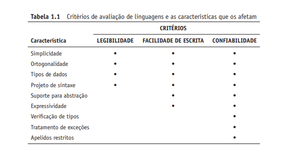
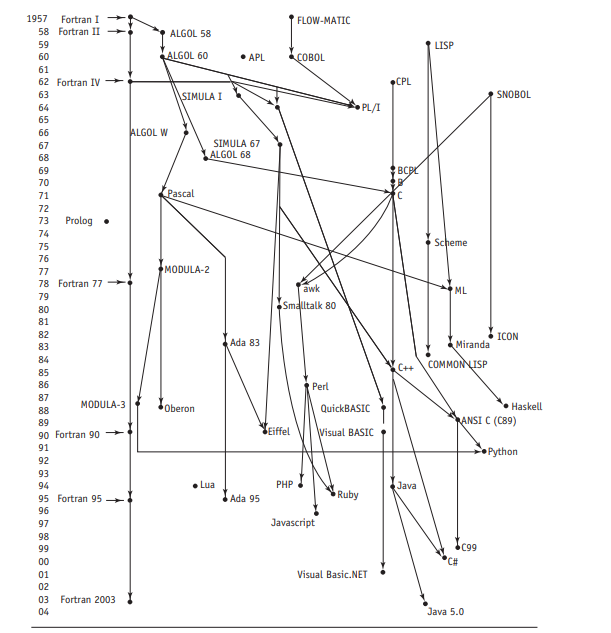

# linguagens de Programação

- fontes

https://www.youtube.com/watch?v=xfDdxqbkiSQ&list=PLnzT8EWpmbka4KukGR184tifzqcuq_ZDv

https://github.com/malbarbo/na-lp-copl

https://malbarbo.pro.br/ensino/2018/5185/

Programming Language Pragmatics  4ed - Michael L.Scott (fonte principal em inglês)

Conceitos de Linguagens de Programação – Robert W. Sebesta (fonte em pt-br)

## 1- Aspectos Preliminares

### 1.1 Razões para estudar linguagens de programação

**1- Capacidade aumentada para expressar ideias:** conhecer os recurso
de outras linguagens pode ajudar ao aprendizado dos mesmos durante o entendimento de uma nova ou até
na simulação do recurso em outras que não o possui.

**2- Embasamento para escolher linguagens adequadas:** consegue escolher qual
linguagem utilizar em determinados projetos e não apenas aquela com qual está familiarizado.

**3- habilidade aumentada para aprender novas linguagens:** entender as pincipais funcionalidades
das lingugens permite aprender novas linguagens mais rápido e com maior tranquilidade.

**4- Melhor entendimento da importância da implementação:**  enteder o porque tal questão foi implemetada de determinada forma
ajuda ao melhor uso da linguagem além de permitir a visuliazação da foram como uma computador executa as diversar construções de uma linaguagem.

**5- Melhor uso de linguagens já conhecidas:** É incomum um programador conhecer e usar todos os recursos da linguagem que ele utiliza. Ao
estudar os conceitos de linguagens de programação, os programadores
podem aprender sobre partes antes desconhecidas e não utilizadas das
linguagens que eles já trabalham e começar a utilizá-las.

**6- Avanço geral na visão geral da computação:** sabe escolher com cuidado cada linguagem é muita mais 
apenas por uso popular.

### 1.2 Domínios de programação

Principais usos de linguagens ao longo dos tempo.

📌Aplicações Científicas

Foco: Cálculos matemáticos complexos (ponto flutuante) e estruturas simples (vetores e matrizes).

Prioridade: Desempenho e eficiência.

Linguagens: Fortran (pioneira e ainda usada) e ALGOL 60.

📌 Aplicações Empresariais

Foco: Precisão em operações decimais, manipulação de texto e geração de relatórios.

Prioridade: Organização comercial e consistência de dados.

Linguagens: COBOL (lançada em 1960 e ainda dominante no setor).

📌 Inteligência Artificial (IA)

Foco: Computação simbólica (nomes em vez de números) e uso de listas encadeadas.

Prioridade: Flexibilidade no código.

Linguagens: LISP, Scheme, Prolog e C.

📌 Programação de Sistemas

Foco: Sistemas operacionais e ferramentas de suporte de baixo nível (hardware).

Prioridade: Máxima eficiência e acesso direto ao hardware.

Linguagens: C (padrão principal, usado no UNIX) e linguagens proprietárias antigas (PL/S, BLISS).

📌 Software para a Web

Foco: Criação, exibição e dinamismo de páginas na internet.

Prioridade: Interatividade e processamento de conteúdo dinâmico.

Linguagens: XHTML (marcação), JavaScript e PHP (script), além de Java.

- hoje em dia todas as linguagens são "génericas" ou seja pode usar pra tudo, mais 
foi criado pra um determinado objetivo específico, pra resolver isso foi criado bibliotecas, frameworks para simular 
esses dominios em específicos.

### O que é uma linguagem de programação

Uma linguagem de programação é um conjunto de regras, palavras e símbolos usado para dar ordens a um computador.

### 1.3 Crtérios de Avaliação de linguagens 

- Como saber se a linguagem é boa pra determinada atividade? 

Pra isso colocamos críterios sobre as caracteristicas  das linguagens como

#### **1- facilidade de leitura(legibilidade)**
Mais segurança, menos erros, diminui tempo de aprendizagem, maior 
traquilidade e na hora de deixar para futuros programadores lerem.

No entanto, ser fácil demais pode ser ruim ou bom dependendo do contexto, por exemplo a abstração pode
ser muito grande ou acabar sendo muito verbosa pela facilidade de leitura.

Outra questão é a orgonalidade, ou seja os recursos da linguagem serem independentes entre si, você acaba inferindo 
as caracteristicas da linguagem,

exemplo
1+1 = 2 em tipo inteiro, logo

1.1+1.1 = 2.2 pois vai somar

Novamente isso pode ser bom ou ruim, no Algol68 torno seu processo de construção 
de criação do compilador extremamente complicado

#### **2- facilidade de escrita** 

Maior capacidade de abstração = maior facilidade na escrita

simplicidade de escrita e ortografia

maior expressividade

menores custos

Um exemplo de facilidade de escrita foi a criação da função pois o computador começava a
errar cálculos em códigos grandes pois o computador esquentava e a tensão do sinal que era 
1 (ligado) não acontecia e computador representava 0(desligado), pra isso os programadores criaram a função pra enxugar o código
e facilitar o treinamento de programadores na linguagem.

#### **3- confiabilidade** 

no geral quanto mais verboso mais confiabilidade

ex: java pra sistemas embutidos(gateways,roteadores, eletrodomesticos inteligentes, paines automotivos)

evitar da merda acontecer. Mas no geral depende do contexto da linguagem.

#### **4- custo**

Geralmente quanto maior a confiabilidade maior o custo da linguagem , seja de manunetanção, implementação ou de recursos

#### Outros Critérios

Portabilidade - ser fácil de implementar em qualquer máquina
Padronização - ser padrão em qualquer ferramenta de uso da lingaugem (ex: js antes da um determinado problema dependendo do 
tipo de navergador que você usa.)

### Diferentes visões 

O projetista, programador, design, inplementador tem diferentes visões sobre a lingaugem o que 
pode ajudar ou atrapalhar dependendo da situação.

### 1.4 INFLUÊNCIAS NO PROJETO DE LINGUAGENS

#### 1- arquitetura do computadores

A arquitetura básica dos computadores tem um efeito profundo no projeto
de linguagens. A maioria das linguagens populares dos últimos 50 anos tem
sido projetada considerando a principal arquitetura de computadores, chamada de **arquitetura de von Neumann**, cujo nome é derivado de um de
seus criadores, John von Neumann (pronuncia-se “von Noyman”). Elas são
chamadas de **linguagens imperativa**

Outras projetam conforme outros tipos de arquitetura como a arquitetura
arquitetura multicore.

#### 2 - Metodologias de programação

as metodologias/paradigmas de programação influência de maneira enorme na construções da linguagem,
como a programação a objetos, a dados e a processos.

### 1.5 Categoria de linguagens 

**Imperativas** -  Linguagens imperativas são um tipo de linguagem de programação que diz ao computador como fazer as coisas, passo a passo, por meio de comandos que mudam o estado da memória.
ex: C, JAVA, PYTHON, PASCAL

**Funcionais** - Linguagens funcionais são um estilo de programação que usa funções matemáticas para criar programas.Em vez de dizer o passo a passo que o computador deve seguir (como em uma receita), você declara quais dados deseja transformar.
haskell, scala, erlang

**lógicas** -Uma linguagem lógica é um tipo de linguagem de programação baseada em regras formais de lógica matemática para expressar fatos e relações sobre um problema.

**orientadas a objetos** fazendo parte das linguagems imperativas a linguagens orientadas a objetos são aquelas que organizam o código usando classes e objetos para representar o mundo real

### 1.6 Trade-Offs 

No projeto de linguagens de programação, um trade-off é a escolha de sacrificar uma característica em favor de outra para atender a objetivos específicos

exemplo: 
Tipagem Estática vs. Dinâmica:Estática:

Maior segurança e detecção de erros em tempo de compilação, mas exige mais código e restringe a flexibilidade inicial.

Dinâmica: Agilidade e expressividade na escrita de código, mas transfere a detecção de erros para o tempo de execução.

### 1.7 Métodos de implementação

No geral as linguagens podem ser implementadas por um dos três métodos gerais.

#### 1- Compiladores: um software que converte de uma lingauaguem pra outra.

No método de compilação, o código-fonte inteiro é traduzido de uma só vez para o código de máquina (linguagem binária) antes de ser executado.Como funciona: Um programa especial chamado compilador lê o seu código, faz análises e gera um arquivo executável próprio para o sistema operacional.Vantagem: A execução do programa é muito rápida, pois o computador já entende o binário diretamente.Desvantagem: O processo de compilação demora antes de rodar, e o executável precisa ser refeito se você mudar de sistema operacional.Exemplos: C, C++ e Rust

obs: melhor explicado futuralmente na matéria de compiladores

#### 2- Interpretação pura

No método de interpretação pura, o código-fonte é lido e executado linha por linha, em tempo real, por um programa chamado interpretador.Como funciona: O interpretador traduz e executa cada instrução na hora, sem gerar um arquivo executável separado.Vantagem: Facilita muito a busca por erros (depuração) e torna o desenvolvimento mais ágil, pois você vê o resultado imediatamente.Desvantagem: A execução costuma ser mais lenta do que a de um programa compilado, já que a tradução acontece junto com o uso.Exemplos: Versões clássicas de algumas linguagens de script ou interpretadores iniciais

#### 3- Implemetação Híbrida

método híbrido mistura características dos dois mundos anteriores para unir velocidade e flexibilidade.Como funciona: O código-fonte é primeiro traduzido parcialmente para uma linguagem intermediária (frequentemente chamada de bytecode). Em seguida, uma máquina virtual ou um interpretador lê esse bytecode e o executa. Muitas tecnologias modernas também usam compilação em tempo de execução (JIT - Just-In-Time) para otimizar partes do código enquanto o programa roda.Vantagens: Oferece boa portabilidade (o mesmo código intermediário roda em qualquer sistema operacional que tenha a máquina virtual adequada) com um desempenho melhor que o da interpretação pura.Desvantagens: Ainda pode ser um pouco menos veloz do que uma compilação totalmente nativa para um hardware específico.Exemplos: Java (que usa a JVM), Python e JavaScript.

### 1.8 Ambientes de programação

Um ambiente de programação é a coleção de ferramentas usadas no desenvolvimento de software. Essa coleção pode consistir em apenas um sistema de
arquivos, um editor de textos, um ligador e um compilador. Ou pode incluir
uma grande coleção de ferramentas integradas, cada uma acessada por meio
de uma interface de usuário uniforme. 

Ex: vscode ou intelli IDEA

### Resumo cap 1 

O estudo de linguagens de programação é valioso por diversas razões: aumenta nossa
capacidade de usar diferentes construções ao escrever programas, permite que escolhamos linguagens para os projetos de forma mais inteligente e torna mais fácil o aprendizado de novas linguagens.
Capítulo 1 Aspectos Preliminares 53
Os computadores são usados em uma variedade de domínios de solução de problemas. O projeto e a avaliação de uma linguagem de programação em particular são
altamente dependentes do domínio para o qual ela será usada.
Dentre os critérios mais importantes para a avaliação de linguagens, estão a legibilidade, a facilidade de escrita, a confiabilidade e o custo geral. Esses critérios servirão de base para examinarmos e julgarmos os recursos das linguagens discutidas no
restante do livro.
As principais influências no projeto de linguagens têm sido a arquitetura de máquina e as metodologias de projeto de software.
Projetar uma linguagem de programação é primariamente um esforço de engenharia, no qual uma longa lista de trade-offs deve ser levada em consideração na escolha
de recursos, construções e capacidades.
Os principais métodos de implementar linguagens de programação são a compilação, a interpretação pura e a implementação híbrida.
Os ambientes de programação têm se tornado parte importante dos sistemas de
desenvolvimento de software, nos quais a linguagem é apenas um dos componentes.

 
##  CAP 2 - Evolução das Principais Linguagens de Programação (historia da computação e programação)

influências de linguagens e datas

1. Primeira linguagem de programação do Mundo - PLANKALKÜL DE ZUSE(calculo de programas de zule)

Desenvolvida em 1945, mas não publicada até 1972 e nunca foi implementada. Muitas de suas capacidades apenas foram publicadas 15 anos após seu desenvolvimento.

Estrutura de dados Avançados

    -ponto flutuante(complemento de dois bit "oculto") vetores, registro.

A seguinte sentença de atribuição de exemplo, a qual atribui o valor da
expressão A[4] + 1 para A[5], ilustra essa notação. A linha rotulada V é para
os índices, e a S é para os tipos de dados. Nesse exemplo, 1.n significa um
inteiro de n bits:

2. Programação de hardware mínima: Pseudocódigos

Qual era o problema de usar código de máquina? 

    -baixa legibilidade
    -modificações de programas tedidosos e possíveis erros
    -deficiências de máquina  - sem indentação ou ponto flutante

## CAP 3 - Descrevendo Sintaxe e Semântica (estudado mais Linguagens Formais e Autômatos)

## CAP 4 - Análise Léxica e Sintática (estudado mais Linguagens Formais e Autômatos)

## CAP 5 - Nomes, Vinculações e Escopos

Objetivo: Debater as principais funcionalidades de linguagens de programação.

### 5.1  -Introdução 

As variavéis são abstração das células de memória podendo ser uma unica célula de inteiro
ou um array com até 3 dimensões

Ela tem um conjunto de propriedades: tipo, valor, memória, escopo, etc.

### 5.2 - Nomes 

Nomes ou identificadores são associados a rótulos de subprogramas, variáveis e etc, sendo
é uma cadeia de caracteres usada para identificar alguma entidade em um programa.

#### 5.2.1 - Porque não é trivial criar uma variavel com qualquer tamanho de caractere? 

No começo esse problema era por conta da memória exacerbada que isso custaria. Hoje em dia, esse problema
de mémoria não é mais válido, entretanto, ainda temos outro problema - a complexidade de implementação
de uma string de armazenamento estático no meu compilador seria maior. Assim, é uma faca de dois gumes
que é necessario balencear dependendo do contexto.

Normalmente as linguagens modernas o nome das entidades deixam a quantidade de caracteres  ilimitados.

#### **5.2.2- E os caracteres especiais ?** 

Algumas linguagens pedem caracteres especiais no começo da linguagem e isso pode ser bom ou ruim dependendo do ponto de
análise.

Pontos bons: fácil identificação apenas com a notação.

Pontos ruins: Prejudica a escritae causa conflitos de sintaxe

outra questão e a sensibilização de caso, por exemplo variaveis podem ou não ser iguais entre **A, B e C e a, b e c**
ou ter fontes parecidas e ocorrer confundir. No caso ser sensiveis  ao caso e elas não serem iguais.

#### **5.2.3- Palavras especiais/reservadas**

As palavras especiais em linguagens de programação são chamadas de palavras reservadas ou palavras-chave (keywords). Elas possuem um significado próprio para o compilador ou interpretador e formam a base da estrutura da linguagem

ex:  tipo de variavél  -  int, boolean e etc

No caso essas palavras não podem ser declaradas como nomes pois o compilador teria que faze rum esforço maior e mais complexo
pra indentificar o tipo de variavél

ex de erro:  int int = 4;

desvantagens: dar excessões de nomes que não podem ser usadas. Isso pode ser ruim quando tem várias 
palavras reservadas, um exemplo disso é no cobol que tem 300 palavras reservadas.

#### **5.3- Variáveis **

As variáveis tem caracteristicas específicas, sendo essas:

1. nome - caracterização da variável
2. endereço ( l - valor) [left] - onde está a variavél, a variável pode ter diferentes endereços ao longo do programa 

em i = 1 e em i = i +1 a variável a esquerda da igualdade e diferente da variavel a direita da igualdade, o tornando
maior que a da direita  após a leitura da linha.

3. tipo  - tipo de dado
4. valor (r - valor) [right] - valor em mémoria da variável
5. tempo de vida  - duração no programa (onde nasce e morre )
6. escopo - onde está essa variavél no codigo

#### **5.3.1- O conceito de vinculação **

definição = Eu quero saber em que momento ocorre determinados eventos, que evento? 

a associação como entre um atributo e uma entidade ou entre uma operação e um símbolo.

Ex: int idade = 25 (em java ou C)

#### **5.3.2- Momentos de vinculação **

1. **Projetos de linguagem** :Ocorre quando os projetistas definem construções fundamentais da linguagem, como o significado do operador +ou palavras-chave reservadas.
2. **implementação da linguagem**: Decisões tomadas pelos desenvolvedores do compilador ou interpretador, como o tamanho exato em bytes alocados para um tipo de dado numérico.
3. **tempo de compilação(*mais importante)** : é o momento em que o código-fonte é traduzido para a linguagem de máquina
4. **tempo de ligação**:Ocorre quando o código compilado é combinado com bibliotecas externas e outros módulos para formar o novovel final.
5. **tempo de carregamento** :Ocorre quando o sistema operacional carrega o programa seguinte para a memória principal, definindo os endereços de memória base.
6. **tempo de execução**(*mais importante) :Ocorre enquanto o programa está rodando ativamente; é o momento em que valores de variáveis ​​são atribuídos, funções são chamadas e a alocação dinâmica de memória acontece.

comprender quando as vinculações ocorrem é pré requisito para entender a semântica de uma linguagem de programção.

### Vinculação de atributos a variáveis 

1. vinculação estática : ocorre antes da execução do programa(tempo de compilação) e permanece inalterada ( C e JAVA)

Tipos:

.explicita:

int x;

.inplicita(por convenção): 

ex: Por letras(I,K,L,M), simbolos $ % &  e etc 

. inferência 

ocorre por "indução" ou argumento indutivo, se algo x é y então tudo é mais ou menos x(interpretado por contexto)

ex: 

i = 1; se i é 1 então i é inteiro

2. Vinculação dinãmica : ocorre ou altera durante a execução do programa.

vantagens: 

+flexibilidade
+expressividade
+facilidade de escrita

Desvantagem: 

-detecção de erros de compilador 
-custo (checagem dinâmica de tipo e interpretação) + custo de criação de compilador
-dificuldade em criar um bom suporte nos editores

### Vinculação de memória e tempo de vida

Alocação: tornar uma célula de mémoria um conjunto de mémoria disponivel.

Desalocação: devolver um célula de memória desvinculada ao conjunto de memória disponível

tempo de vida:  é o tempo durante o qual a variálvel está vinculada a uma celula de memória especifica.

classificação segundo tempo de vida de  variaveis escalares(guarda um valor por vez)

1) estática

vinculada a cédula de memória antes da execução do programa e premace vinculda a mesma célula durante a execução.

ex:

variveis globais e etc

Vantegens: eficiência e sensibilidade a história.

Desvantagem:  flexibilidade (não suporta recursão), a méma memória não pode ser compartilhada por variveis diferentes.

2) Dinâmica na pilha 

vinculada a célula de mémoria quando sua declaração é elaborada

ex: variavéis locais em java 

vantagem: recurssão e compartilhamento de mémoria.

desvantagens: custo de alocação e desalocação, subprogramas não podem ser sensível a contexto

3) Dinâmica explicita no heap
4) Dinâmica implicita no heap

## CAP 6 - Tipos de dados

## CAP 7 - Expressões e Sentenças de Atribuição

## CAP 8 - Estruturas de Controle no Nível de Sentença

## CAP 9 - Subprogramas

## CAP 10 - Implementando Subprogramas

## CAP 11 -  Tipos de Dados Abstratos e Construções de Encapsulamento

## CAP 12 - Suporte para a Programação Orientada a Objetos

## CAP 13 - Concorrência

## CAP 14 - Tratamento de Exceções e Tratamento de Eventos

## CAP 15 - Linguagens de Programação Funcional

## CAP 16 -  Linguagens de Programação Lógica

